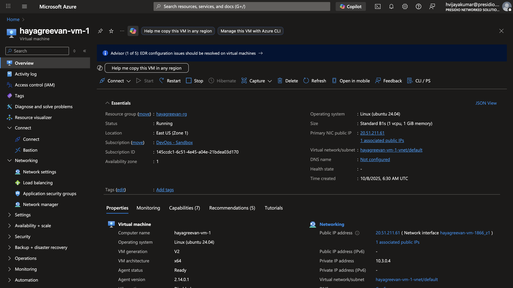
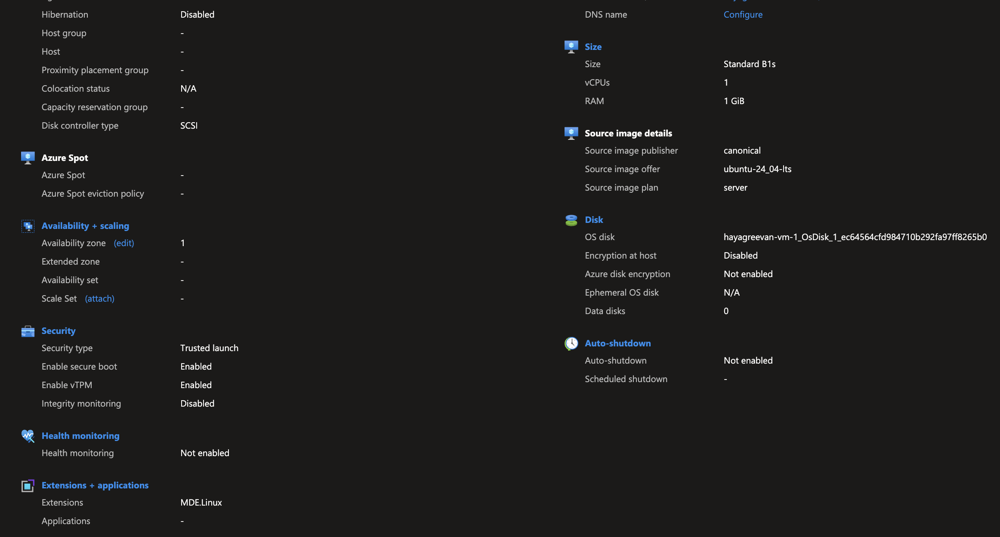
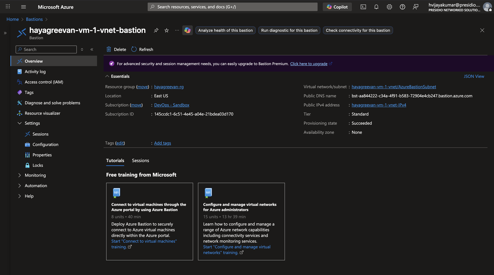
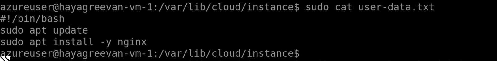
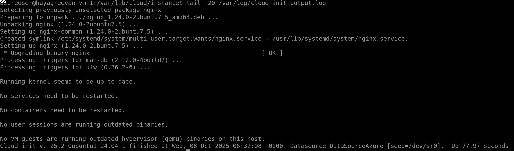

# Day 1 Tasks

Here is your first task of the day
1. Create a Azure VM with custom data script to install nginx web server  
2. Create an Azure Bastion to SSH into the machine
3. Only NGINX Web Service should be accessible from internet
4. Extra [ After SSH into the VM, try to locate the file path of custom data script and log file of your custom data script execution]

## VM Creation and Bastion Creation

## CustomData storage location

## Cloud init log file
