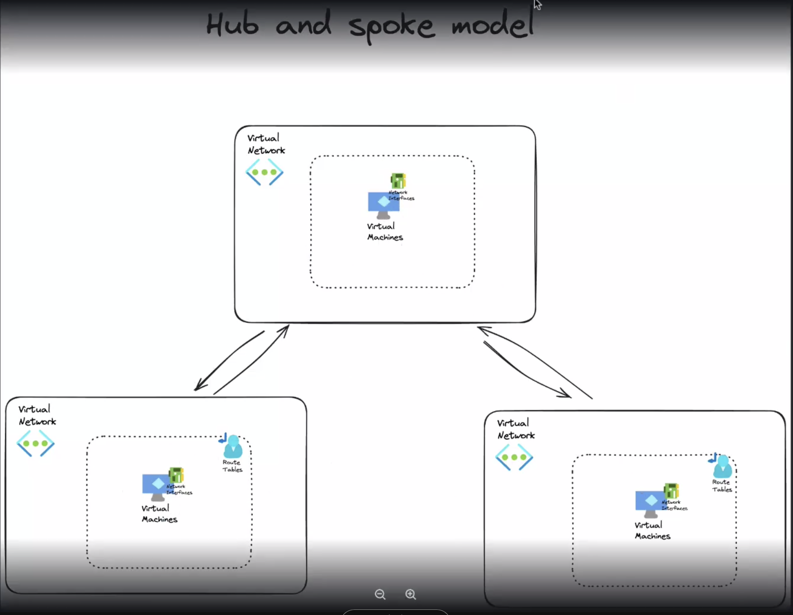
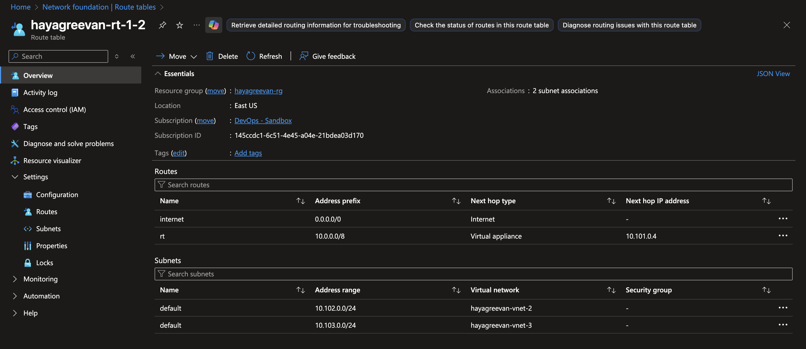
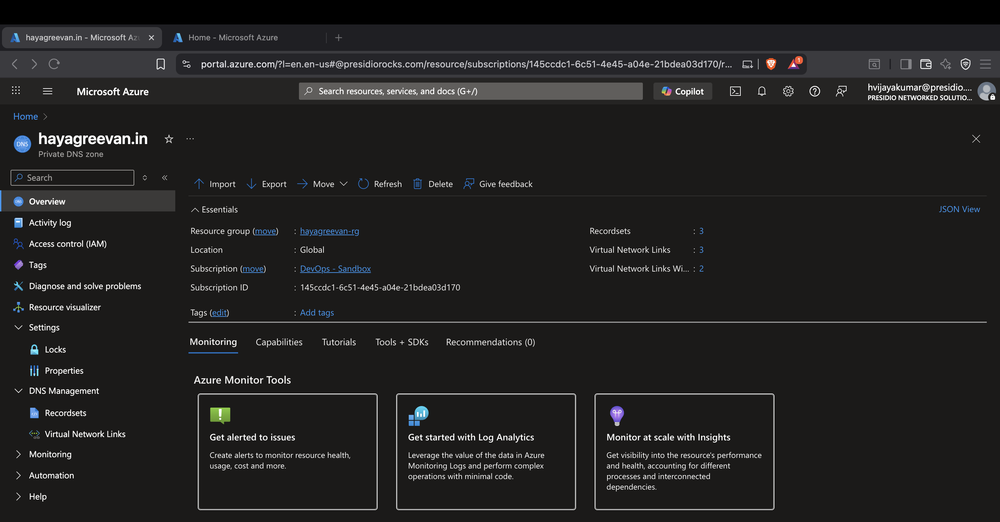
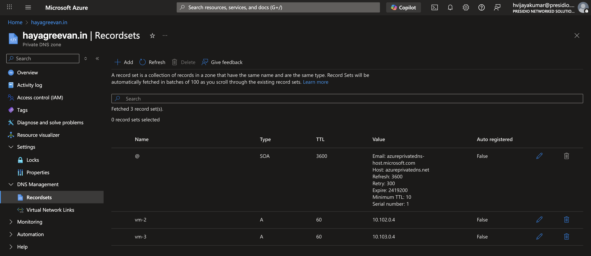
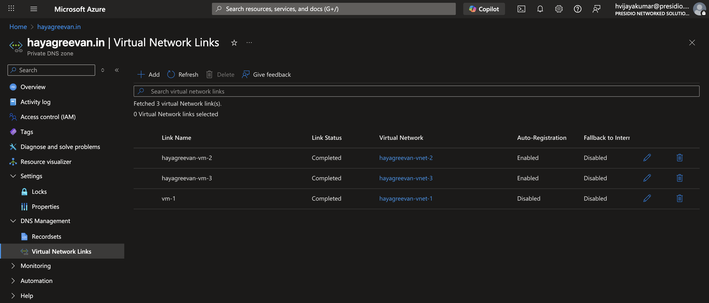
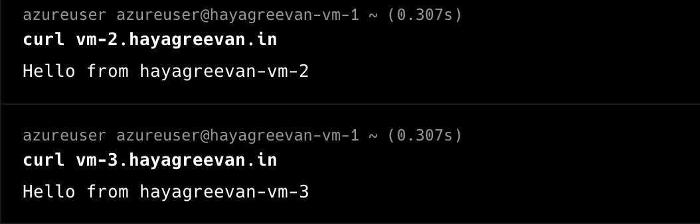

# Day 2 Task

## Notes
VNet Peering
- All Networks are connnected as Local Network (No need for specifically mentioning in route table)
- It is not transitive



## Task

Create 3 VNETs and deploy 3 VMs in each VNET. 1st and 2nd VNET should be private and 3rd VNET should be public . If VM from 1st VNET needs to connect to vm in 2nd VNET it should pass through vm in 3rd VNET
Extra - Make this flow entirely with private dns zones so , that you can reach the VM’s via private domain names instead of IP’s.


**1. Created 3 Virtual Networks and created Virtual Machine in each Vnet**

VM-1 : Public  
VM-2, VM-3 : Private


vm-1 (Public) : azureuser@48.216.218.13

vm-2 : azureuser@10.102.0.4

vm-3 : azureuser@10.103.0.4

**2. VNet Peering has been done Vnet-1 <-> Vnet-2  and Vnet1 <-> Vnet-3**  
**3. Created Route Table for Vnet-2 and Vnet-3 routing through Vnet-1**  



**4. Enable IP Forwarding in VM-1 Network Interface and enable it in OS level**
``` sh
sudo nano /etc/sysctl.conf # net.ipv4.ip_forward=1
sudo sysctl -p
```
## Private DNS Zones






