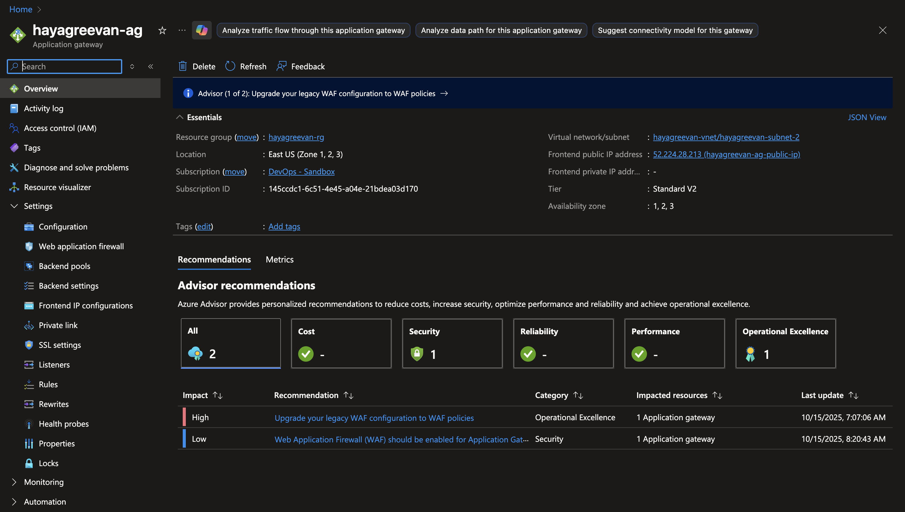
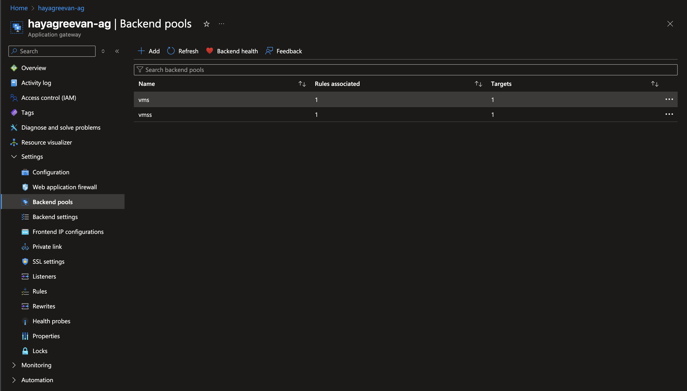
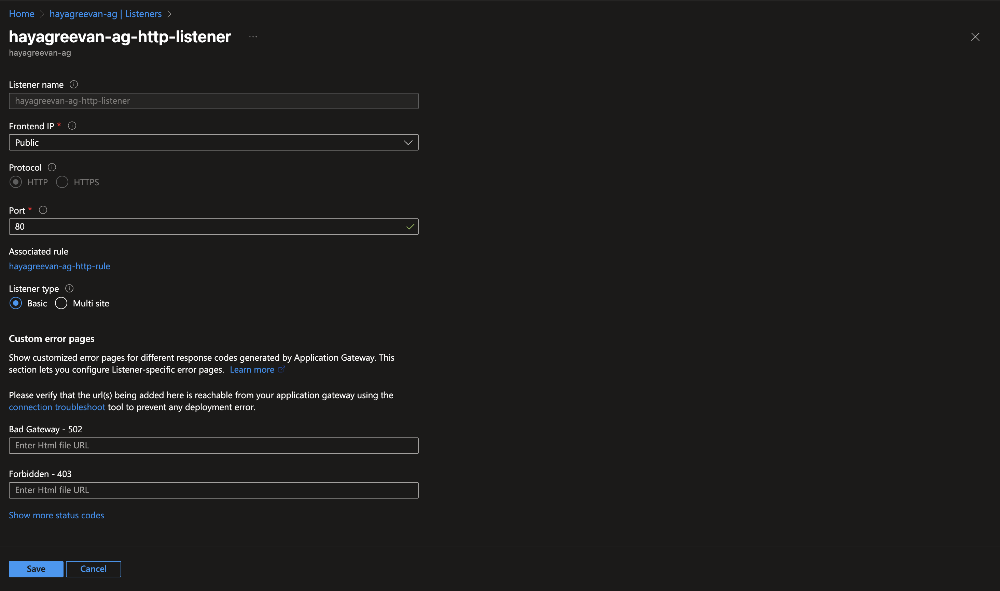
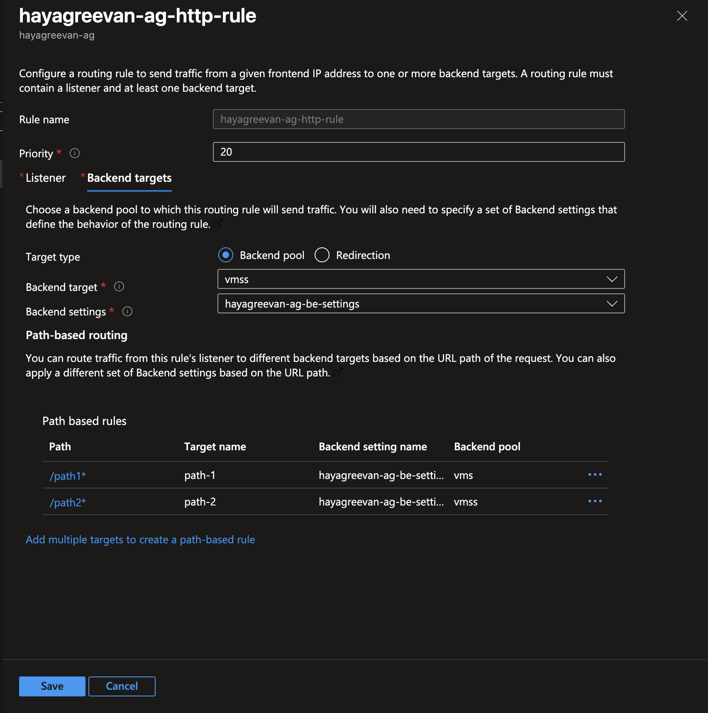
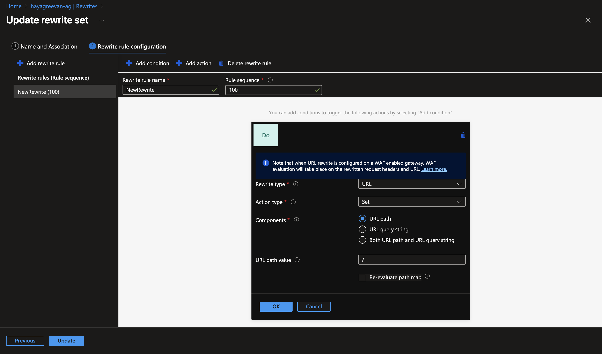

# Day 4 Tasks
 
1. Create a Virtual Machine Scale Set configured with web server each VM should able to show hostname and region, when we browse it. Attach the Virtual Machine Scale Set with Load Balancer.
 
2. Create two Virtual Machine Scale Sets, the first Virtual Machine Scale Set should be configured with path /path1 and second Virtual Machine Scale Set should be configured with path /path2 and attach both to an Application Gateway.

3. Bonus Task:
- Deploy a Layer 7 Load Balancer in East US that satisfies these requirements:
- Host two distinct fake domains on the same Public IP and Port 443: hike.summit.local and bike.summit.local.
- Route hike traffic to one backend pool and bike traffic to a different backend pool.
- Enable the Web Application Firewall (WAF) in Prevention mode.
- Configure End-to-End SSL. You must generate self-signed certificates for your backend servers and configure the gateway to trust them.


## CustomData Script

### Script 1
``` sh
#!/bin/bash
sudo apt update
sudo apt install nginx -y
REGION=$(curl -s -H "Metadata:true" "http://169.254.169.254/metadata/instance/compute/location?api-version=2021-02-01&format=text")
echo "Hello from $(hostname) - $REGION" > /var/www/html/index.html
sudo systemctl restart nginx
```

### Script 2
``` bash
#!/bin/bash
apt-get update -y
apt-get install -y nginx curl


REGION=$(curl -s -H "Metadata:true" "http://169.254.169.254/metadata/instance/compute/location?api-version=2021-02-01&format=text")
HOSTNAME=$(hostname)


echo "<h1>Azure VM Scale Set Web Server</h1><p><b>Hostname:</b> $HOSTNAME</p><p><b>Region:</b> $REGION</p>" > /var/www/html/index.html


systemctl enable nginx
systemctl restart nginx
```

## Notes
- **To add a VMSS to Application Gateway, It must be in uniform Orchestration Mode.**
- Loadbalancer doesn't work as Round-robin
 
**Task 1**
- Created vmss with standard b1s sku with loadbalancer

**Task 2**
- Created another vmss with uniform orchestration mode without loadbalancer
- Created Application Gateway
- Created Two backend pools with path-based routing
- Setup rules for path-based routing
- Added rewrite to set url path to / in path-based-routing

### Overview


### Backend Pools


### Listeners


### Rules


### Rewrites



## Links
- https://learn.microsoft.com/en-us/azure/application-gateway/create-url-route-portal
- https://learn.microsoft.com/en-us/azure/application-gateway/rewrite-url-portal