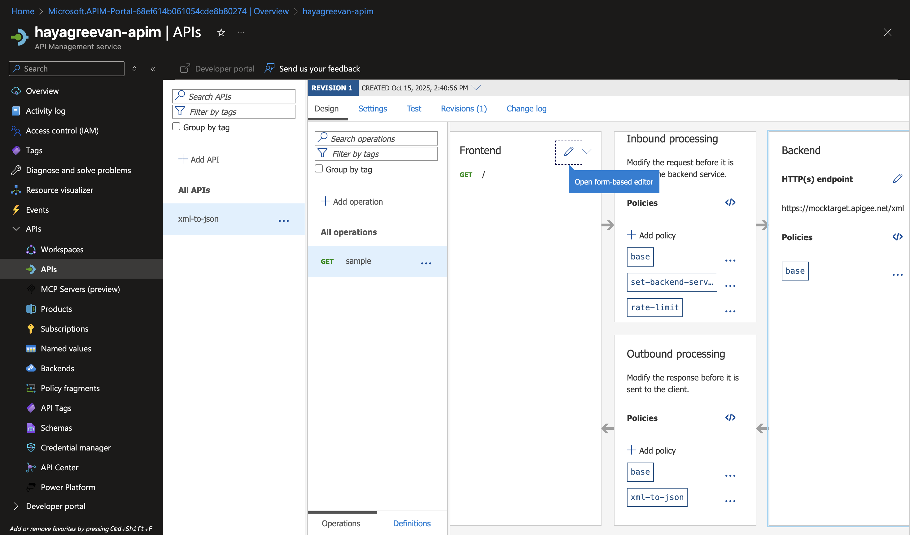

# Day 5 Tasks

## Task 1:
Implement a global, high-performance, self-healing routing solution.  
Deploy the yesterday task 1 in both East US and West US 2.  
Implement a global routing service (using its default .net domain) that directs users to the closest available region to minimize latency.  
Configure application-level health probing. The routing service must not just ping the endpoint; it must check a specific path (e.g., /status.html) looking for a 200 OK.  
Demonstrate that if you "break" the application in East US (e.g., stop the web service or delete the status file) while leaving the VMs running, traffic automatically shifts to West US 2.  

**DNS Name is required for adding public ip as Endpoint in Traffic Manager**


## Task 2:
Use API Management (APIM) to create a secure, modern facade over a dummy legacy endpoint.  
Define an API in APIM that points to a public XML data source (find any public XML URL to act as the "legacy backend").  
Transform the backend's XML response into JSON before sending it back to the client.  
Protect the backend from abuse by implementing a Rate Limit (e.g., 5 calls per minute based on the client's IP or subscription).  

1. Create API Management Service
2. Create HTTP API named xml-to-json with 


### APIM Policy for GET /
``` xml
<!--
    - Policies are applied in the order they appear.
    - Position <base/> inside a section to inherit policies from the outer scope.
    - Comments within policies are not preserved.
-->
<!-- Add policies as children to the <inbound>, <outbound>, <backend>, and <on-error> elements -->
<policies>
    <!-- Throttle, authorize, validate, cache, or transform the requests -->
    <inbound>
        <base />
        <set-backend-service base-url="https://mocktarget.apigee.net/xml" />
        <rate-limit calls="5" renewal-period="60" />
    </inbound>
    <!-- Control if and how the requests are forwarded to services  -->
    <backend>
        <base />
    </backend>
    <!-- Customize the responses -->
    <outbound>
        <base />
        <xml-to-json kind="javascript-friendly" apply="always" consider-accept-header="false" />
    </outbound>
    <!-- Handle exceptions and customize error responses  -->
    <on-error>
        <base />
    </on-error>
</policies>
```


## Links
- https://learn.microsoft.com/en-us/azure/traffic-manager/traffic-manager-how-it-works
- https://learn.microsoft.com/en-us/azure/traffic-manager/traffic-manager-configure-weighted-routing-method