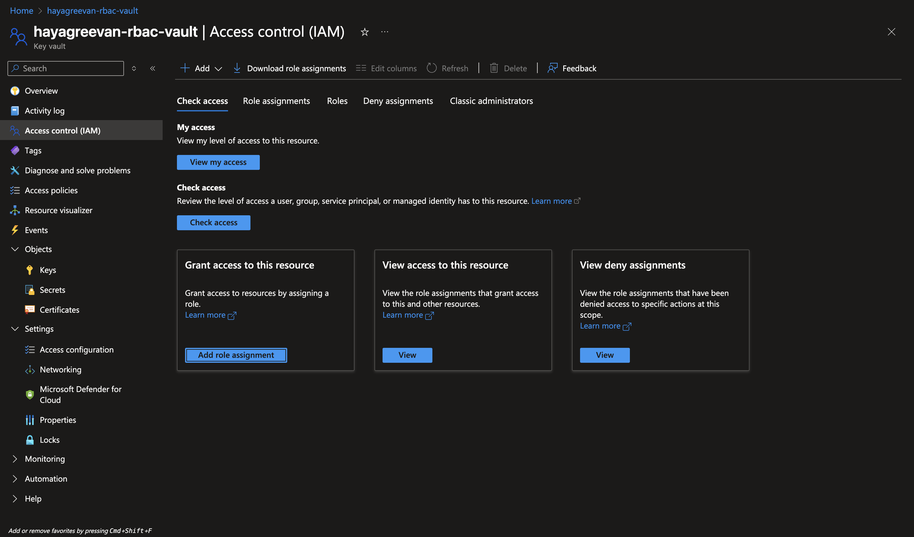
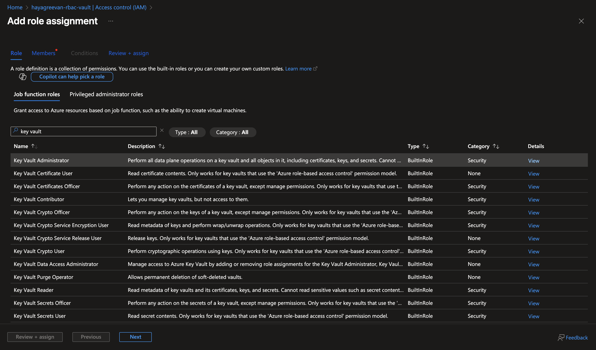
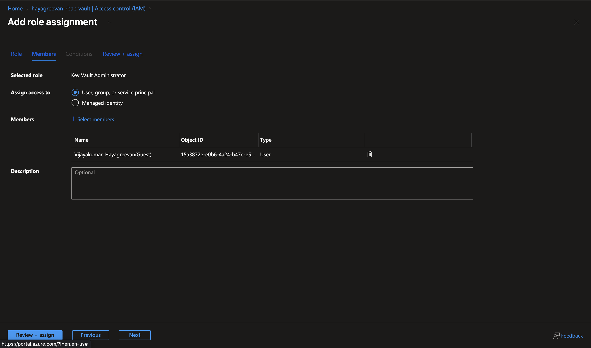
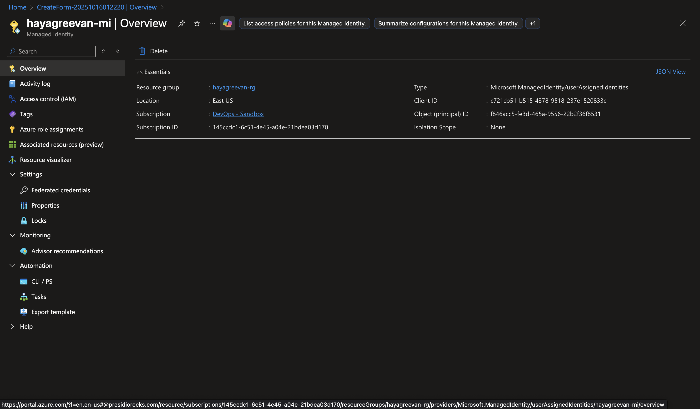
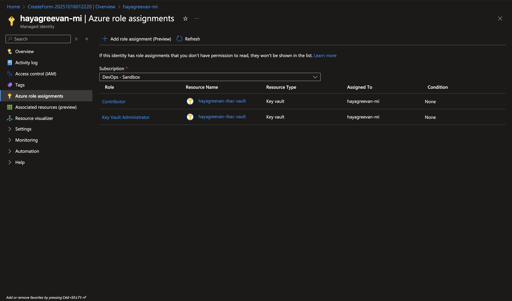
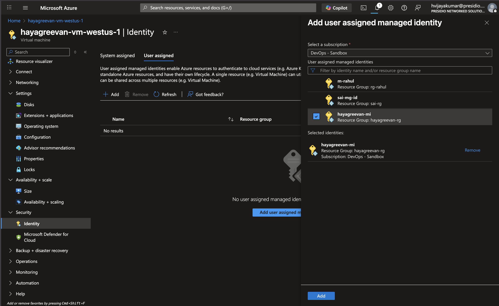
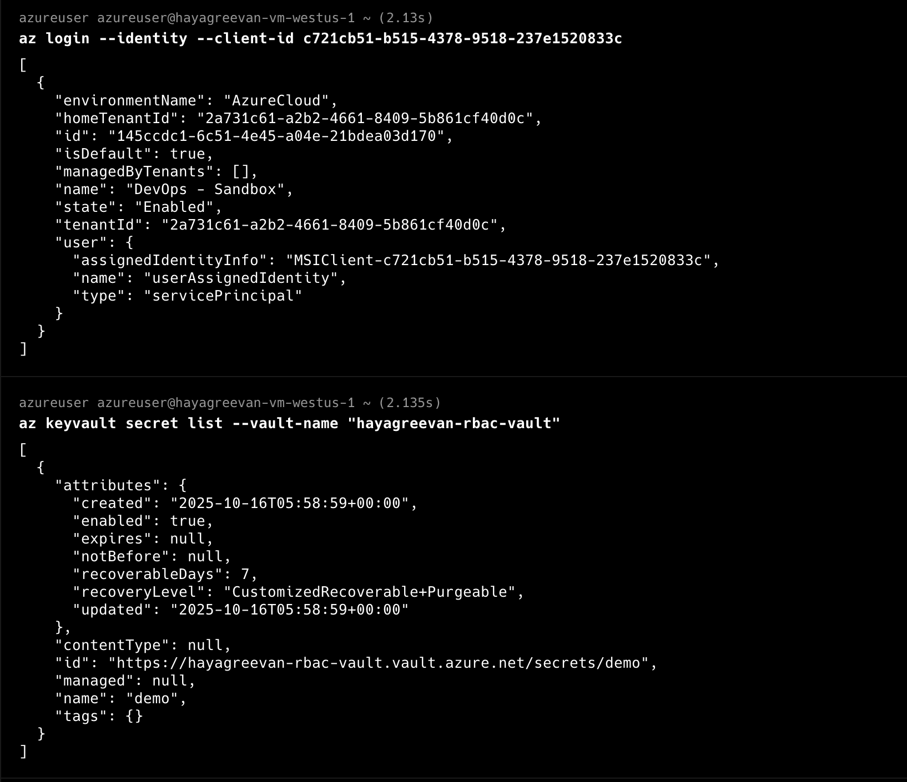

# Day 6 Tasks

## Azure RBAC Task
**1. Create an Azure KeyVault with RBAC Permission model (and NOT Vault Access Policy)**


**2. Create a secret in the Keyvault. [You cannot see or create secrets by default. Look for a way to assign yourself DATA plane access to your keyvault]**


1. Go to Key vault's Access Control IAM Section and Click Add Role Assignment


2. Choose Key Vault Admninistrator Role


3. Add User



## Extra
Create an User Managed Identity
Install AZ CLI in any one of your running VMs
Fetch the secret from Key Vault inside your VM [using the User Managed Identity]

1. Create Managed Identity



2. Add role assignment



3. In VM, Go to Security -> Identity -> User assigned. Add newly created Managed Identity




4. SSH into VM and Install AZ CLI

``` bash
curl -sL https://aka.ms/InstallAzureCLIDeb | sudo bash
```

5. AZ CLI commands

``` bash
az login --identity --client-id c721cb51-b515-4378-9518-237e1520833c # <managed-identity-client-id>

az keyvault secret list --vault-name "hayagreevan-rbac-vault"

az keyvault secret show --vault-name "hayagreevan-rbac-vault" --name "demo"
```
