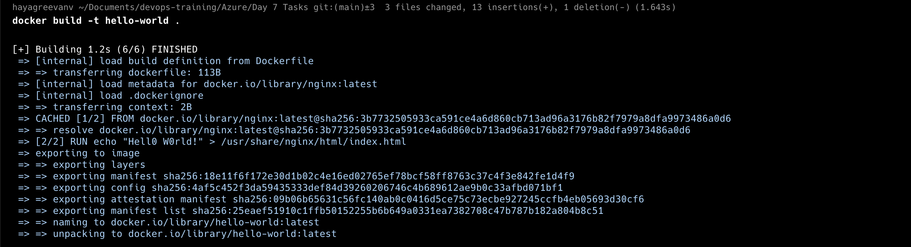
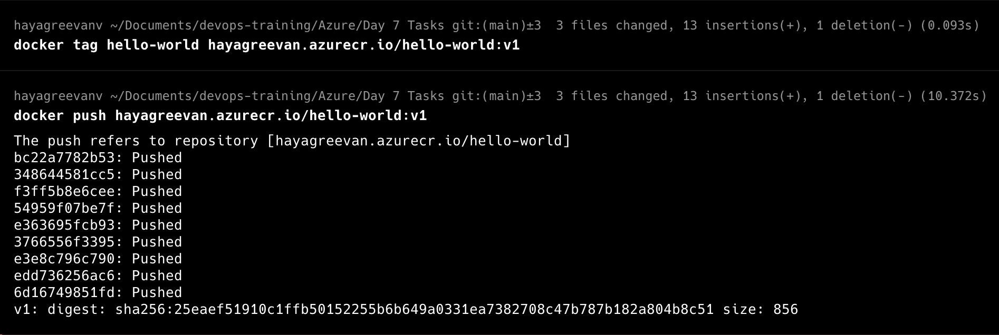
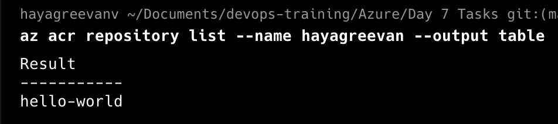
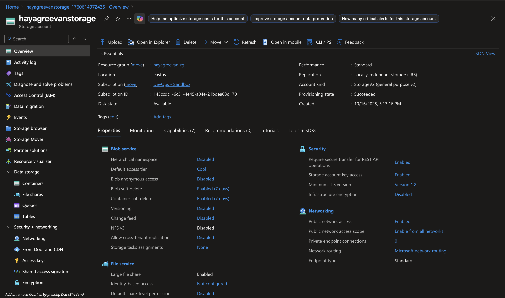
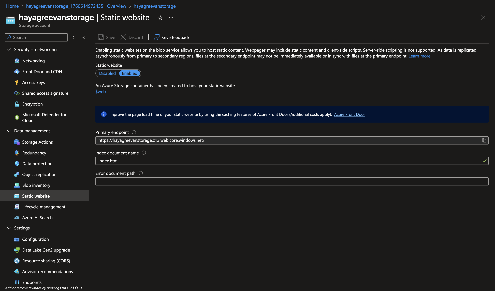
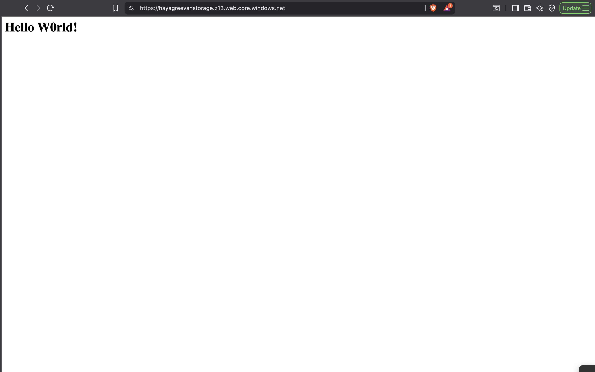
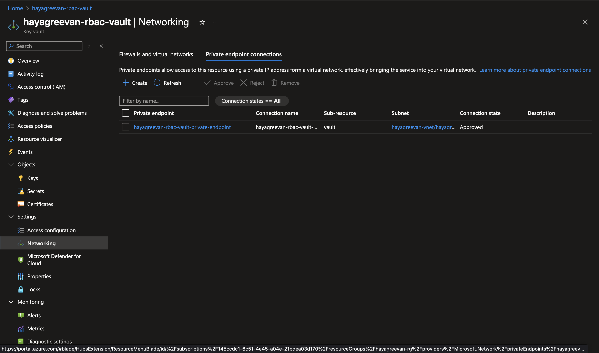
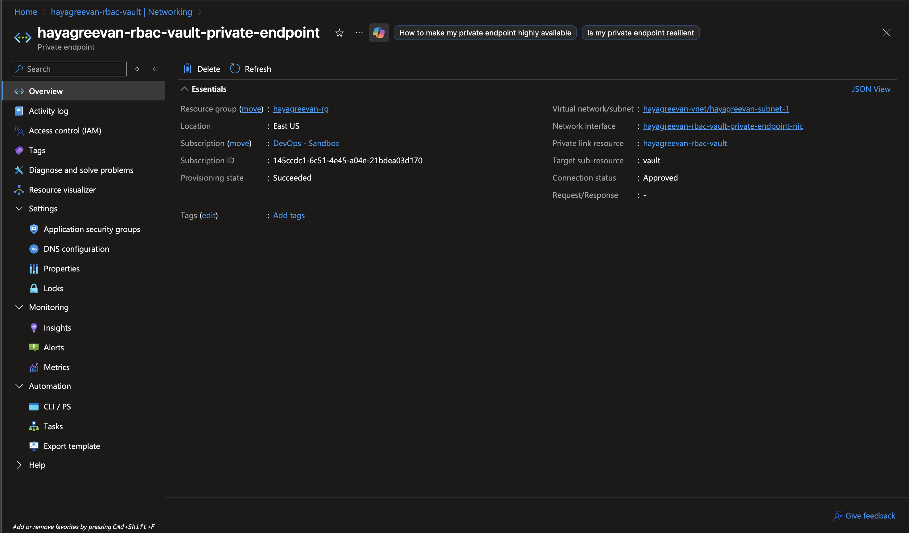

# Day 7 Tasks

## Task1:
**1. Create a simple nginx image and push it to Azure Container Registry**

1. Creating Azure Container Registry
``` sh
az acr create --resource-group hayagreevan-rg --name hayagreevan --sku Standard   --role-assignment-mode 'rbac-abac' 
Argument '--role-assignment-mode' is in preview and under development. Reference and support levels: https://aka.ms/CLI_refstatus
Argument '--dnl-scope' is in preview and under development. Reference and support levels: https://aka.ms/CLI_refstatus
Warning: You have successfully updated the registry authentication mode to enable RBAC Registry + ABAC Repository Permissions. ACR Tasks within the registry that do not have an assigned identity for source registry access will not have data plane access to the registry. To configure source registry data plane access for your existing Tasks, you must explicitly assign an Entra identity for accessing the source registry using the '--source-registry-auth-id' flag in 'az acr task update'. Please refer to https://aka.ms/acr/auth/abac for more details.
{
  "adminUserEnabled": false,
  "anonymousPullEnabled": false,
  "autoGeneratedDomainNameLabelScope": "TenantReuse",
  "creationDate": "2025-10-16T11:56:52.917892+00:00",
  "dataEndpointEnabled": false,
  "dataEndpointHostNames": [],
  "encryption": {
    "keyVaultProperties": null,
    "status": "disabled"
  },
  "id": "/subscriptions/145ccdc1-6c51-4e45-a04e-21bdea03d170/resourceGroups/hayagreevan-rg/providers/Microsoft.ContainerRegistry/registries/hayagreevan",
  "identity": null,
  "location": "eastus",
  "loginServer": "hayagreevan.azurecr.io",
  "metadataSearch": "Disabled",
  "name": "hayagreevan",
  "networkRuleBypassOptions": "AzureServices",
  "networkRuleSet": null,
  "policies": {
    "azureAdAuthenticationAsArmPolicy": {
      "status": "enabled"
    },
    "exportPolicy": {
      "status": "enabled"
    },
    "quarantinePolicy": {
      "status": "disabled"
    },
    "retentionPolicy": {
      "days": 7,
      "lastUpdatedTime": "2025-10-16T11:57:00.111062+00:00",
      "status": "disabled"
    },
    "softDeletePolicy": {
      "lastUpdatedTime": "2025-10-16T11:57:00.111132+00:00",
      "retentionDays": 7,
      "status": "disabled"
    },
    "trustPolicy": {
      "status": "disabled",
      "type": "Notary"
    }
  },
  "privateEndpointConnections": [],
  "provisioningState": "Succeeded",
  "publicNetworkAccess": "Enabled",
  "resourceGroup": "hayagreevan-rg",
  "roleAssignmentMode": "AbacRepositoryPermissions",
  "sku": {
    "name": "Standard",
    "tier": "Standard"
  },
  "status": null,
  "systemData": {
    "createdAt": "2025-10-16T11:56:52.917892+00:00",
    "createdBy": "hvijayakumar@presidio.com",
    "createdByType": "User",
    "lastModifiedAt": "2025-10-16T11:56:52.917892+00:00",
    "lastModifiedBy": "hvijayakumar@presidio.com",
    "lastModifiedByType": "User"
  },
  "tags": {},
  "type": "Microsoft.ContainerRegistry/registries",
  "zoneRedundancy": "Disabled"
}
```

2. Login to Azure ACR
``` sh
az acr login --name hayagreevan
```


3. Create Dockerfile

``` Dockerfile
FROM nginx:latest
RUN echo "Hell0 W0rld!" > /usr/share/nginx/html/index.html
```

3. Build and Push Docker Image 

``` sh
docker build -t hello-world .
docker tag hello-world hayagreevan.azurecr.io/hello-world:v1
docker push hayagreevan.azurecr.io/hello-world:v1

az acr repository list --name hayagreevan --output table
```






**2. Deploy a static website on azure storage account**

1. Create a Azure Storage Account




2. In Data Management Section -> Static Website -> Enable it




3. Upload index.html in $web container of storage account.




## Task2:
Create an Azure Key Vault and add a secret, a key, and a certificate to it.
Access the Key Vault from your local machine using the Azure CLI to retrieve the stored secret, key, and certificate
Next, configure a Private Endpoint for the Key Vault to restrict access to within avirtual network.
Deploy a Virtual Machine inside the same Virtual Network and use the AzureCLI on the VM to access and retrieve the Key Vault’s secret, key, and certificate.

1. Created Azure KeyVault and added a secret,key,certificate
2. Installed AZ CLI in local machine
3. Created Private Endpoint and restricted the public access of the Key Vault



4. KeyVault is accessible for all the vms available in the subnet which contains Private Endpoint.

## Bonus Task:
 
### Scenario:
Simulate the automated, polling-based user profile ingestion process by manually uploading a file to Azure Blob Storage, sending a message with metadata and blob URL to Azure Service Bus, and then inserting the data into Cosmos DB, ensuring data integrity and decoupling between services
### Steps:
User Upload Simulation Manually upload a profile picture to a designated Azure Blob Storage container. During the upload, you must use the portal's advanced options to attach the user's profile information (User ID, Email, and Display Name) as Blob Metadata.
Manual Polling and Queuing You will act as the "polling mechanism." Your task is to inspect the newly uploaded blob in the storage container. Based on the blob's URL and the metadata you find attached to it, you must manually construct structured JSON message. You will then send this message to an Azure Service Bus Queue, effectively placing the task in a "to-do" list for the next stage of processing.
Manual Message Processing and Persistence You will act as the "database writer." Your task is to peek at the message waiting in the Service Bus Queue. You will copy the content of this message. Finally, you will navigate to the Azure Cosmos DB instance and use the copied data to manually create a new document in the User Profiles container, completing the workflow.
### Outcome Expected:
Goal is to manually connect the output of each service (Blob Storage, Service Bus, and Cosmos DB) to simulate a decoupled system, ensuring that the final JSON document in Cosmos DB accurately reflects the metadata and file location from the initial blob upload, while keeping each step distinct and independent


## Links
- https://learn.microsoft.com/en-us/azure/container-registry/
- https://learn.microsoft.com/en-us/azure/container-instances/container-instances-quickstart
- https://stackoverflow.com/questions/72456529/the-container-image-doesnt-support-specified-os-linux-for-container-group

- https://learn.microsoft.com/en-us/cli/azure/keyvault?view=azure-cli-latest
- https://learn.microsoft.com/en-us/cli/azure/?view=azure-cli-latest