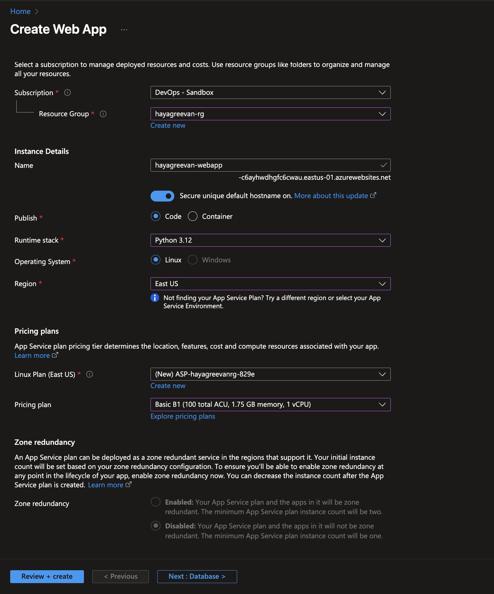
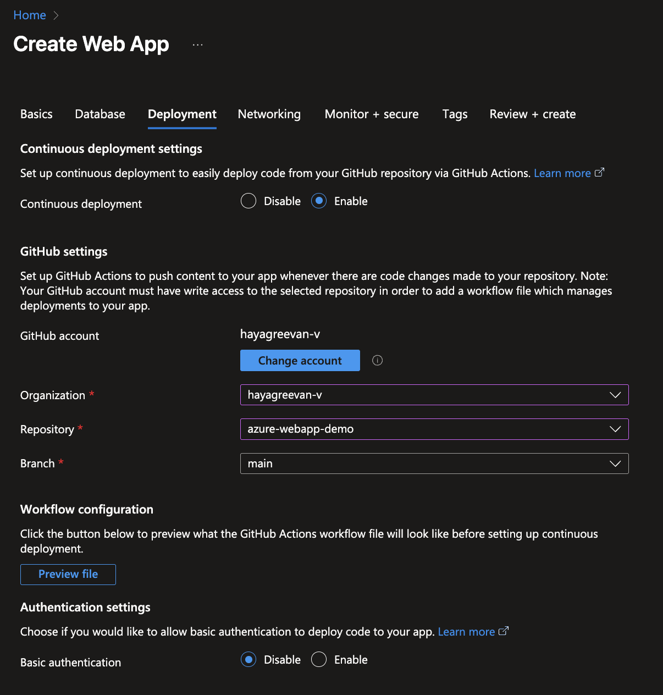
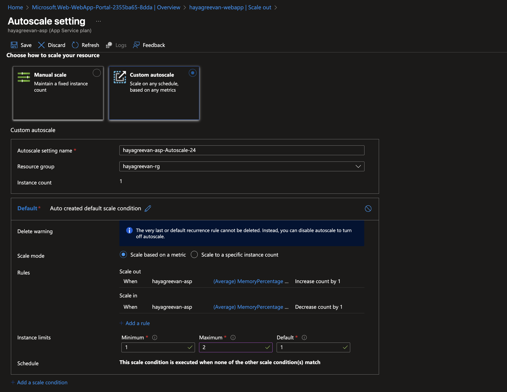
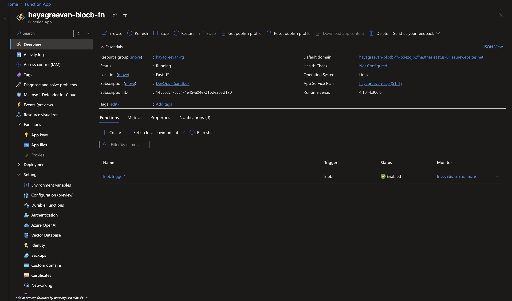
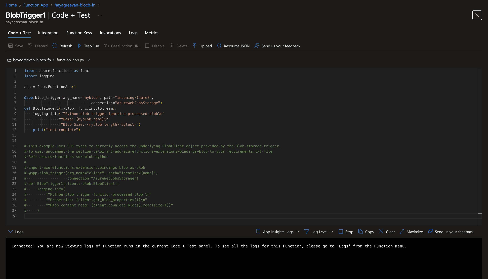
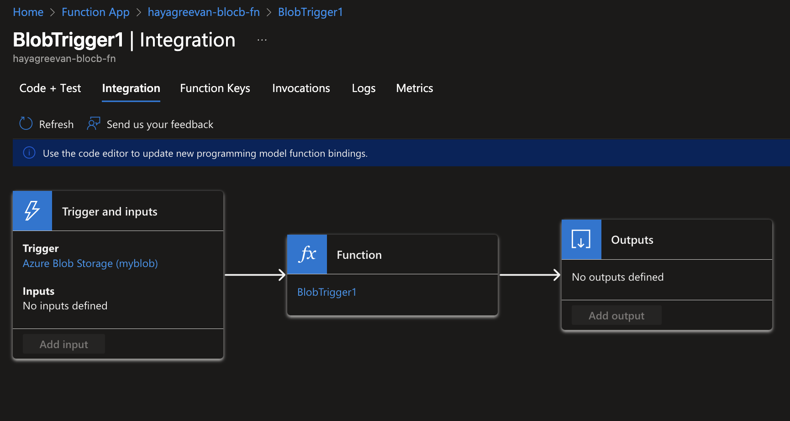

# Day 8 Tasks

## Task 1:
You are required to deploy a web application (Flask / FastAPI) on Azure App Service using GitHub for continuous deployment.
Once deployed, configure autoscaling for the App Service Plan — when memory usage exceeds 80%, the instance count should increase by one, and when it drops below 40%, it should decrease by one.
 

## Task 2:
Nithya, a DevOps engineer at company X, wants to receive immediate notifications whenever a new file is added to a Storage Account.
note: For notification purposes, use a print/logging statements.

