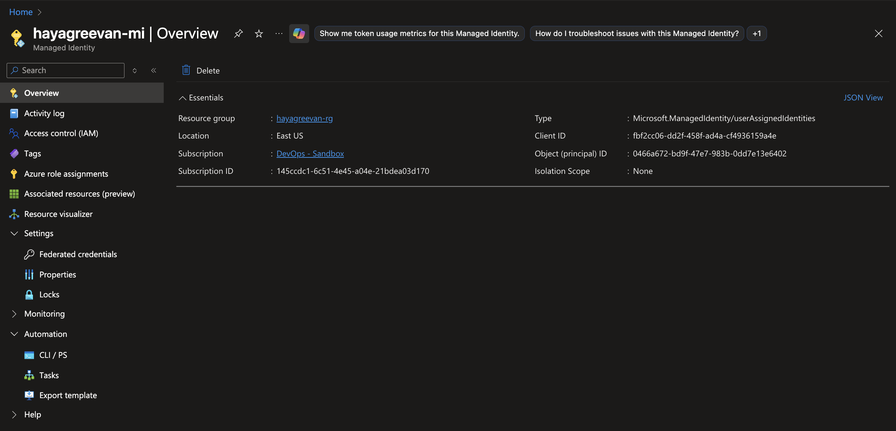
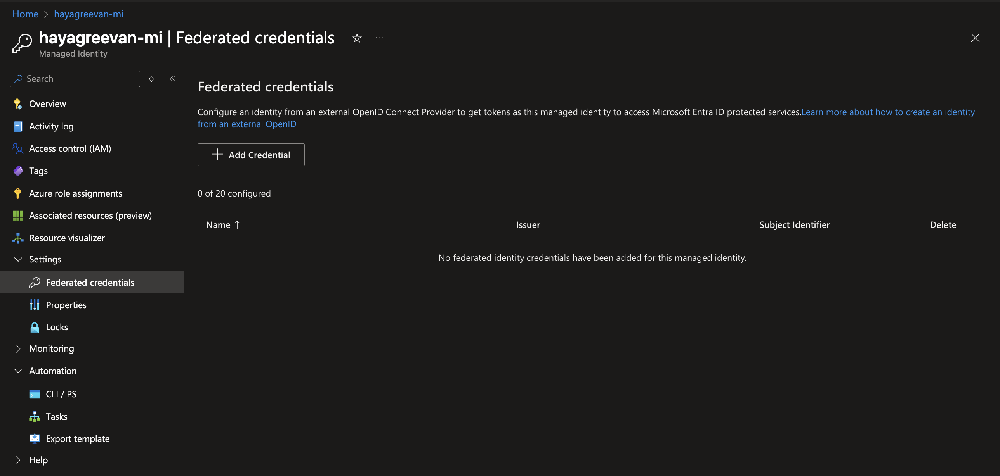
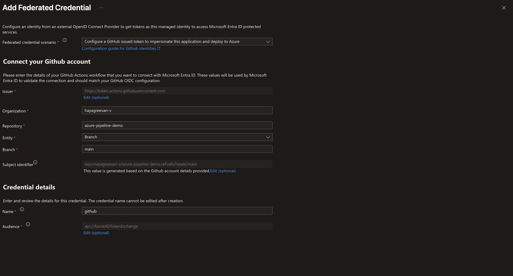
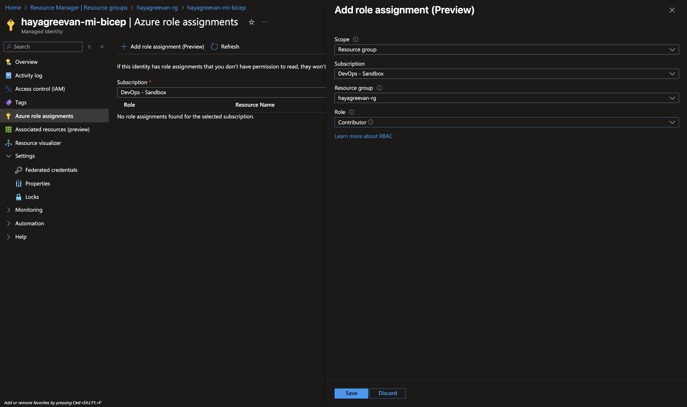
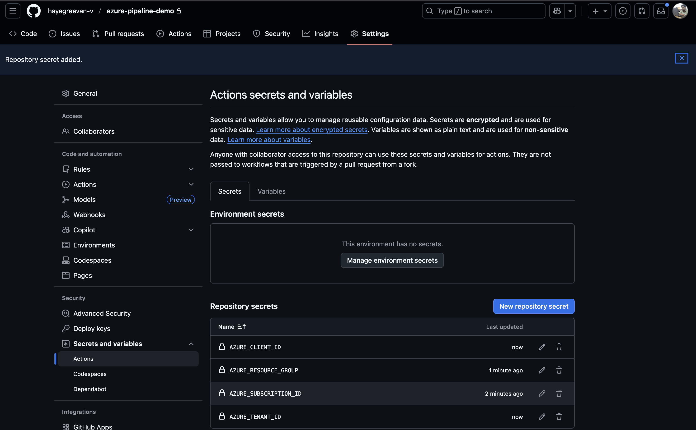

# Day 9 Tasks

explore deep in ARM and Bicep template provisioning a single simple resource, also try to deploy these via yaml pipelines. Extend to play with variablization, environments and  templating stuffs
first try to deploy the ARM template, Bicep Code via locally and then try to automate via pipeline


https://learn.microsoft.com/en-us/azure/templates/microsoft.aad/domainservices?pivots=deployment-language-bicep
For References : Will have ARM, Bicep, Terraform for most of the azure resources
 

## VM Creations

 ``` bash
 az deployment group create --resource-group hayagreevan-rg --template-file template.json --parameters @parameters.json --parameters adminPublicKey="ssh-rsa AAAAB3NzaC1yc2EAAAADAQABAAABgQDpqSjySip3HRQybdHJkjY9RSxuAxn9awCiEZLqFBMCcVHANhA5Gzc5g8351EwocnMbQQJTAGlRFX2tVsetEQk145/nF+MkbYJIgqUTLFGOWFsdw2thYMzQbf2aPI9KX0a6Ok/3six3+nHeN5SRn2jSG5JG+nNCcm+mO+1wR3eZ5T0/At4lFy4eJNZi8X7BRNQXrjlGqFIrFcQ26tjsumv2Alba/0c6AHKOyK11xKwLiGz8aqkGn+BxrVZHIDpTDn5veX57QLndQxuqYkONFkDOUNRNTyELc1bmPqgUiR9dQhQagtur6b1lQ6AWGxB7N+1rI3MzZ/+wgn7pYL8hh2BJ6y9aLxAYHm7mvgS6z+Sewuv2+k39ToHQf/M2f0GjtIba121TckCgHWTCnzAcOEJvW8knpZmlALD4qZyOKp5IY8A6/glrdV1midog2/TFPjbvOq/0vky0gSmkXLgT8VbWocRSiJgy3qSKY/62g/1gITj5bQUvagtsDc/Cfmjsa60= generated-by-azure"
```
``` json
{
  "id": "/subscriptions/145ccdc1-6c51-4e45-a04e-21bdea03d170/resourceGroups/hayagreevan-rg/providers/Microsoft.Resources/deployments/template",
  "location": null,
  "name": "template",
  "properties": {
    "correlationId": "28398dee-d729-4e61-9bdb-9efeae5bc4be",
    "debugSetting": null,
    "dependencies": [
      {
        "dependsOn": [
          {
            "id": "/subscriptions/145ccdc1-6c51-4e45-a04e-21bdea03d170/resourceGroups/hayagreevan-rg/providers/Microsoft.Network/networkSecurityGroups/hayagreevan-vm-1-nsg",
            "resourceGroup": "hayagreevan-rg",
            "resourceName": "hayagreevan-vm-1-nsg",
            "resourceType": "Microsoft.Network/networkSecurityGroups"
          },
          {
            "id": "/subscriptions/145ccdc1-6c51-4e45-a04e-21bdea03d170/resourceGroups/hayagreevan-rg/providers/Microsoft.Network/virtualNetworks/hayagreevan-westus2-vnet",
            "resourceGroup": "hayagreevan-rg",
            "resourceName": "hayagreevan-westus2-vnet",
            "resourceType": "Microsoft.Network/virtualNetworks"
          },
          {
            "id": "/subscriptions/145ccdc1-6c51-4e45-a04e-21bdea03d170/resourceGroups/hayagreevan-rg/providers/Microsoft.Network/publicIpAddresses/hayagreevan-vm-1-ip",
            "resourceGroup": "hayagreevan-rg",
            "resourceName": "hayagreevan-vm-1-ip",
            "resourceType": "Microsoft.Network/publicIpAddresses"
          }
        ],
        "id": "/subscriptions/145ccdc1-6c51-4e45-a04e-21bdea03d170/resourceGroups/hayagreevan-rg/providers/Microsoft.Network/networkInterfaces/hayagreevan-vm-1692_z1",
        "resourceGroup": "hayagreevan-rg",
        "resourceName": "hayagreevan-vm-1692_z1",
        "resourceType": "Microsoft.Network/networkInterfaces"
      },
      {
        "dependsOn": [
          {
            "id": "/subscriptions/145ccdc1-6c51-4e45-a04e-21bdea03d170/resourceGroups/hayagreevan-rg/providers/Microsoft.Network/networkInterfaces/hayagreevan-vm-1692_z1",
            "resourceGroup": "hayagreevan-rg",
            "resourceName": "hayagreevan-vm-1692_z1",
            "resourceType": "Microsoft.Network/networkInterfaces"
          }
        ],
        "id": "/subscriptions/145ccdc1-6c51-4e45-a04e-21bdea03d170/resourceGroups/hayagreevan-rg/providers/Microsoft.Compute/virtualMachines/hayagreevan-vm-1",
        "resourceGroup": "hayagreevan-rg",
        "resourceName": "hayagreevan-vm-1",
        "resourceType": "Microsoft.Compute/virtualMachines"
      }
    ],
    "diagnostics": null,
    "duration": "PT7.291751S",
    "error": null,
    "extensions": null,
    "mode": "Incremental",
    "onErrorDeployment": null,
    "outputResources": [
      {
        "apiVersion": null,
        "extension": null,
        "id": "/subscriptions/145ccdc1-6c51-4e45-a04e-21bdea03d170/resourceGroups/hayagreevan-rg/providers/Microsoft.Compute/virtualMachines/hayagreevan-vm-1",
        "identifiers": null,
        "resourceGroup": "hayagreevan-rg",
        "resourceType": null
      },
      {
        "apiVersion": null,
        "extension": null,
        "id": "/subscriptions/145ccdc1-6c51-4e45-a04e-21bdea03d170/resourceGroups/hayagreevan-rg/providers/Microsoft.Network/networkInterfaces/hayagreevan-vm-1692_z1",
        "identifiers": null,
        "resourceGroup": "hayagreevan-rg",
        "resourceType": null
      },
      {
        "apiVersion": null,
        "extension": null,
        "id": "/subscriptions/145ccdc1-6c51-4e45-a04e-21bdea03d170/resourceGroups/hayagreevan-rg/providers/Microsoft.Network/networkSecurityGroups/hayagreevan-vm-1-nsg",
        "identifiers": null,
        "resourceGroup": "hayagreevan-rg",
        "resourceType": null
      },
      {
        "apiVersion": null,
        "extension": null,
        "id": "/subscriptions/145ccdc1-6c51-4e45-a04e-21bdea03d170/resourceGroups/hayagreevan-rg/providers/Microsoft.Network/publicIpAddresses/hayagreevan-vm-1-ip",
        "identifiers": null,
        "resourceGroup": "hayagreevan-rg",
        "resourceType": null
      },
      {
        "apiVersion": null,
        "extension": null,
        "id": "/subscriptions/145ccdc1-6c51-4e45-a04e-21bdea03d170/resourceGroups/hayagreevan-rg/providers/Microsoft.Network/virtualNetworks/hayagreevan-westus2-vnet",
        "identifiers": null,
        "resourceGroup": "hayagreevan-rg",
        "resourceType": null
      }
    ],
    "outputs": {
      "adminUsername": {
        "type": "String",
        "value": "azureuser"
      }
    },
    "parameters": {
      "addressPrefixes": {
        "type": "Array",
        "value": [
          "10.4.0.0/16"
        ]
      },
      "adminPublicKey": {
        "type": "SecureString"
      },
      "adminUsername": {
        "type": "String",
        "value": "azureuser"
      },
      "enablePeriodicAssessment": {
        "type": "String",
        "value": "ImageDefault"
      },
      "hibernationEnabled": {
        "type": "Bool",
        "value": false
      },
      "location": {
        "type": "String",
        "value": "westus2"
      },
      "networkInterfaceName1": {
        "type": "String",
        "value": "hayagreevan-vm-1692_z1"
      },
      "networkSecurityGroupName": {
        "type": "String",
        "value": "hayagreevan-vm-1-nsg"
      },
      "networkSecurityGroupRules": {
        "type": "Array",
        "value": [
          {
            "name": "SSH",
            "properties": {
              "access": "Allow",
              "destinationAddressPrefix": "*",
              "destinationPortRange": "22",
              "direction": "Inbound",
              "priority": 300,
              "protocol": "TCP",
              "sourceAddressPrefix": "*",
              "sourcePortRange": "*"
            }
          },
          {
            "name": "HTTP",
            "properties": {
              "access": "Allow",
              "destinationAddressPrefix": "*",
              "destinationPortRange": "80",
              "direction": "Inbound",
              "priority": 320,
              "protocol": "TCP",
              "sourceAddressPrefix": "*",
              "sourcePortRange": "*"
            }
          }
        ]
      },
      "nicDeleteOption": {
        "type": "String",
        "value": "Delete"
      },
      "osDiskDeleteOption": {
        "type": "String",
        "value": "Delete"
      },
      "osDiskType": {
        "type": "String",
        "value": "StandardSSD_LRS"
      },
      "pipDeleteOption": {
        "type": "String",
        "value": "Delete"
      },
      "publicIpAddressName1": {
        "type": "String",
        "value": "hayagreevan-vm-1-ip"
      },
      "publicIpAddressSku": {
        "type": "String",
        "value": "Standard"
      },
      "publicIpAddressType": {
        "type": "String",
        "value": "Static"
      },
      "secureBoot": {
        "type": "Bool",
        "value": true
      },
      "securityType": {
        "type": "String",
        "value": "TrustedLaunch"
      },
      "subnetName": {
        "type": "String",
        "value": "default"
      },
      "subnets": {
        "type": "Array",
        "value": [
          {
            "name": "default",
            "properties": {
              "addressPrefix": "10.4.0.0/24"
            }
          }
        ]
      },
      "vTPM": {
        "type": "Bool",
        "value": true
      },
      "virtualMachine1Zone": {
        "type": "String",
        "value": "1"
      },
      "virtualMachineComputerName1": {
        "type": "String",
        "value": "hayagreevan-vm-1"
      },
      "virtualMachineName": {
        "type": "String",
        "value": "hayagreevan-vm-1"
      },
      "virtualMachineName1": {
        "type": "String",
        "value": "hayagreevan-vm-1"
      },
      "virtualMachineRG": {
        "type": "String",
        "value": "hayagreevan-rg"
      },
      "virtualMachineSize": {
        "type": "String",
        "value": "Standard_B1s"
      },
      "virtualNetworkName": {
        "type": "String",
        "value": "hayagreevan-westus2-vnet"
      }
    },
    "parametersLink": null,
    "providers": [
      {
        "id": null,
        "namespace": "Microsoft.Network",
        "providerAuthorizationConsentState": null,
        "registrationPolicy": null,
        "registrationState": null,
        "resourceTypes": [
          {
            "aliases": null,
            "apiProfiles": null,
            "apiVersions": null,
            "capabilities": null,
            "defaultApiVersion": null,
            "locationMappings": null,
            "locations": [
              "westus2"
            ],
            "properties": null,
            "resourceType": "networkInterfaces",
            "zoneMappings": null
          },
          {
            "aliases": null,
            "apiProfiles": null,
            "apiVersions": null,
            "capabilities": null,
            "defaultApiVersion": null,
            "locationMappings": null,
            "locations": [
              "westus2"
            ],
            "properties": null,
            "resourceType": "networkSecurityGroups",
            "zoneMappings": null
          },
          {
            "aliases": null,
            "apiProfiles": null,
            "apiVersions": null,
            "capabilities": null,
            "defaultApiVersion": null,
            "locationMappings": null,
            "locations": [
              "westus2"
            ],
            "properties": null,
            "resourceType": "virtualNetworks",
            "zoneMappings": null
          },
          {
            "aliases": null,
            "apiProfiles": null,
            "apiVersions": null,
            "capabilities": null,
            "defaultApiVersion": null,
            "locationMappings": null,
            "locations": [
              "westus2"
            ],
            "properties": null,
            "resourceType": "publicIpAddresses",
            "zoneMappings": null
          }
        ]
      },
      {
        "id": null,
        "namespace": "Microsoft.Compute",
        "providerAuthorizationConsentState": null,
        "registrationPolicy": null,
        "registrationState": null,
        "resourceTypes": [
          {
            "aliases": null,
            "apiProfiles": null,
            "apiVersions": null,
            "capabilities": null,
            "defaultApiVersion": null,
            "locationMappings": null,
            "locations": [
              "westus2"
            ],
            "properties": null,
            "resourceType": "virtualMachines",
            "zoneMappings": null
          }
        ]
      }
    ],
    "provisioningState": "Succeeded",
    "templateHash": "18319823091107251623",
    "templateLink": null,
    "timestamp": "2025-10-22T18:03:56.857871+00:00",
    "validatedResources": null,
    "validationLevel": null
  },
  "resourceGroup": "hayagreevan-rg",
  "tags": null,
  "type": "Microsoft.Resources/deployments"
}

```

## JSON to Bicep Conversion

``` bash
az bicep decompile --file template.json
```
``` bash
The configuration value of bicep.use_binary_from_path has been set to 'false'.
WARNING: Decompilation is a best-effort process, as there is no guaranteed mapping from ARM JSON to Bicep Template or Bicep Parameters.
You may need to fix warnings and errors in the generated bicep/bicepparam file(s), or decompilation may fail entirely if an accurate conversion is not possible.
If you would like to report any issues or inaccurate conversions, please see https://github.com/Azure/bicep/issues.
/Users/hayagreevanv/Downloads/template.bicep(13,7) : Warning no-unused-params: Parameter "virtualMachineName" is declared but never used. [https://aka.ms/bicep/linter-diagnostics#no-unused-params]
/Users/hayagreevanv/Downloads/template.bicep(16,7) : Warning no-unused-params: Parameter "virtualMachineRG" is declared but never used. [https://aka.ms/bicep/linter-diagnostics#no-unused-params]
/Users/hayagreevanv/Downloads/template.bicep(21,7) : Warning no-unused-params: Parameter "hibernationEnabled" is declared but never used. [https://aka.ms/bicep/linter-diagnostics#no-unused-params]
/Users/hayagreevanv/Downloads/template.bicep(33,5) : Warning no-unused-vars: Variable "vnetName" is declared but never used. [https://aka.ms/bicep/linter-diagnostics#no-unused-vars]
```

## VM Creation - Bicep
``` bash
az deployment group create --resource-group hayagreevan-rg --template-file template.bicep --parameters @parameters.json --parameters adminPublicKey="ssh-rsa AAAAB3NzaC1yc2EAAAADAQABAAABgQDpqSjySip3HRQybdHJkjY9RSxuAxn9awCiEZLqFBMCcVHANhA5Gzc5g8351EwocnMbQQJTAGlRFX2tVsetEQk145/nF+MkbYJIgqUTLFGOWFsdw2thYMzQbf2aPI9KX0a6Ok/3six3+nHeN5SRn2jSG5JG+nNCcm+mO+1wR3eZ5T0/At4lFy4eJNZi8X7BRNQXrjlGqFIrFcQ26tjsumv2Alba/0c6AHKOyK11xKwLiGz8aqkGn+BxrVZHIDpTDn5veX57QLndQxuqYkONFkDOUNRNTyELc1bmPqgUiR9dQhQagtur6b1lQ6AWGxB7N+1rI3MzZ/+wgn7pYL8hh2BJ6y9aLxAYHm7mvgS6z+Sewuv2+k39ToHQf/M2f0GjtIba121TckCgHWTCnzAcOEJvW8knpZmlALD4qZyOKp5IY8A6/glrdV1midog2/TFPjbvOq/0vky0gSmkXLgT8VbWocRSiJgy3qSKY/62g/1gITj5bQUvagtsDc/Cfmjsa60= generated-by-azure"
/Users/hayagreevanv/Downloads/template.bicep(13,7) : Warning no-unused-params: Parameter "virtualMachineName" is declared but never used. [https://aka.ms/bicep/linter-diagnostics#no-unused-params]
/Users/hayagreevanv/Downloads/template.bicep(16,7) : Warning no-unused-params: Parameter "virtualMachineRG" is declared but never used. [https://aka.ms/bicep/linter-diagnostics#no-unused-params]
/Users/hayagreevanv/Downloads/template.bicep(21,7) : Warning no-unused-params: Parameter "hibernationEnabled" is declared but never used. [https://aka.ms/bicep/linter-diagnostics#no-unused-params]
/Users/hayagreevanv/Downloads/template.bicep(33,5) : Warning no-unused-vars: Variable "vnetName" is declared but never used. [https://aka.ms/bicep/linter-diagnostics#no-unused-vars]
```
``` json
{
  "id": "/subscriptions/145ccdc1-6c51-4e45-a04e-21bdea03d170/resourceGroups/hayagreevan-rg/providers/Microsoft.Resources/deployments/template",
  "location": null,
  "name": "template",
  "properties": {
    "correlationId": "243f26b2-ffee-42be-80a4-45ebdee68741",
    "debugSetting": null,
    "dependencies": [
      {
        "dependsOn": [
          {
            "id": "/subscriptions/145ccdc1-6c51-4e45-a04e-21bdea03d170/resourceGroups/hayagreevan-rg/providers/Microsoft.Network/networkSecurityGroups/hayagreevan-vm-1-nsg",
            "resourceGroup": "hayagreevan-rg",
            "resourceName": "hayagreevan-vm-1-nsg",
            "resourceType": "Microsoft.Network/networkSecurityGroups"
          },
          {
            "id": "/subscriptions/145ccdc1-6c51-4e45-a04e-21bdea03d170/resourceGroups/hayagreevan-rg/providers/Microsoft.Network/publicIPAddresses/hayagreevan-vm-1-ip",
            "resourceGroup": "hayagreevan-rg",
            "resourceName": "hayagreevan-vm-1-ip",
            "resourceType": "Microsoft.Network/publicIPAddresses"
          },
          {
            "id": "/subscriptions/145ccdc1-6c51-4e45-a04e-21bdea03d170/resourceGroups/hayagreevan-rg/providers/Microsoft.Network/virtualNetworks/hayagreevan-westus2-vnet",
            "resourceGroup": "hayagreevan-rg",
            "resourceName": "hayagreevan-westus2-vnet",
            "resourceType": "Microsoft.Network/virtualNetworks"
          }
        ],
        "id": "/subscriptions/145ccdc1-6c51-4e45-a04e-21bdea03d170/resourceGroups/hayagreevan-rg/providers/Microsoft.Network/networkInterfaces/hayagreevan-vm-1692_z1",
        "resourceGroup": "hayagreevan-rg",
        "resourceName": "hayagreevan-vm-1692_z1",
        "resourceType": "Microsoft.Network/networkInterfaces"
      },
      {
        "dependsOn": [
          {
            "id": "/subscriptions/145ccdc1-6c51-4e45-a04e-21bdea03d170/resourceGroups/hayagreevan-rg/providers/Microsoft.Network/networkInterfaces/hayagreevan-vm-1692_z1",
            "resourceGroup": "hayagreevan-rg",
            "resourceName": "hayagreevan-vm-1692_z1",
            "resourceType": "Microsoft.Network/networkInterfaces"
          }
        ],
        "id": "/subscriptions/145ccdc1-6c51-4e45-a04e-21bdea03d170/resourceGroups/hayagreevan-rg/providers/Microsoft.Compute/virtualMachines/hayagreevan-vm-1",
        "resourceGroup": "hayagreevan-rg",
        "resourceName": "hayagreevan-vm-1",
        "resourceType": "Microsoft.Compute/virtualMachines"
      }
    ],
    "diagnostics": null,
    "duration": "PT6.9655499S",
    "error": null,
    "extensions": null,
    "mode": "Incremental",
    "onErrorDeployment": null,
    "outputResources": [
      {
        "apiVersion": null,
        "extension": null,
        "id": "/subscriptions/145ccdc1-6c51-4e45-a04e-21bdea03d170/resourceGroups/hayagreevan-rg/providers/Microsoft.Compute/virtualMachines/hayagreevan-vm-1",
        "identifiers": null,
        "resourceGroup": "hayagreevan-rg",
        "resourceType": null
      },
      {
        "apiVersion": null,
        "extension": null,
        "id": "/subscriptions/145ccdc1-6c51-4e45-a04e-21bdea03d170/resourceGroups/hayagreevan-rg/providers/Microsoft.Network/networkInterfaces/hayagreevan-vm-1692_z1",
        "identifiers": null,
        "resourceGroup": "hayagreevan-rg",
        "resourceType": null
      },
      {
        "apiVersion": null,
        "extension": null,
        "id": "/subscriptions/145ccdc1-6c51-4e45-a04e-21bdea03d170/resourceGroups/hayagreevan-rg/providers/Microsoft.Network/networkSecurityGroups/hayagreevan-vm-1-nsg",
        "identifiers": null,
        "resourceGroup": "hayagreevan-rg",
        "resourceType": null
      },
      {
        "apiVersion": null,
        "extension": null,
        "id": "/subscriptions/145ccdc1-6c51-4e45-a04e-21bdea03d170/resourceGroups/hayagreevan-rg/providers/Microsoft.Network/publicIPAddresses/hayagreevan-vm-1-ip",
        "identifiers": null,
        "resourceGroup": "hayagreevan-rg",
        "resourceType": null
      },
      {
        "apiVersion": null,
        "extension": null,
        "id": "/subscriptions/145ccdc1-6c51-4e45-a04e-21bdea03d170/resourceGroups/hayagreevan-rg/providers/Microsoft.Network/virtualNetworks/hayagreevan-westus2-vnet",
        "identifiers": null,
        "resourceGroup": "hayagreevan-rg",
        "resourceType": null
      }
    ],
    "outputs": {
      "adminUsername": {
        "type": "String",
        "value": "azureuser"
      }
    },
    "parameters": {
      "addressPrefixes": {
        "type": "Array",
        "value": [
          "10.4.0.0/16"
        ]
      },
      "adminPublicKey": {
        "type": "SecureString"
      },
      "adminUsername": {
        "type": "String",
        "value": "azureuser"
      },
      "enablePeriodicAssessment": {
        "type": "String",
        "value": "ImageDefault"
      },
      "hibernationEnabled": {
        "type": "Bool",
        "value": false
      },
      "location": {
        "type": "String",
        "value": "westus2"
      },
      "networkInterfaceName1": {
        "type": "String",
        "value": "hayagreevan-vm-1692_z1"
      },
      "networkSecurityGroupName": {
        "type": "String",
        "value": "hayagreevan-vm-1-nsg"
      },
      "networkSecurityGroupRules": {
        "type": "Array",
        "value": [
          {
            "name": "SSH",
            "properties": {
              "access": "Allow",
              "destinationAddressPrefix": "*",
              "destinationPortRange": "22",
              "direction": "Inbound",
              "priority": 300,
              "protocol": "TCP",
              "sourceAddressPrefix": "*",
              "sourcePortRange": "*"
            }
          },
          {
            "name": "HTTP",
            "properties": {
              "access": "Allow",
              "destinationAddressPrefix": "*",
              "destinationPortRange": "80",
              "direction": "Inbound",
              "priority": 320,
              "protocol": "TCP",
              "sourceAddressPrefix": "*",
              "sourcePortRange": "*"
            }
          }
        ]
      },
      "nicDeleteOption": {
        "type": "String",
        "value": "Delete"
      },
      "osDiskDeleteOption": {
        "type": "String",
        "value": "Delete"
      },
      "osDiskType": {
        "type": "String",
        "value": "StandardSSD_LRS"
      },
      "pipDeleteOption": {
        "type": "String",
        "value": "Delete"
      },
      "publicIpAddressName1": {
        "type": "String",
        "value": "hayagreevan-vm-1-ip"
      },
      "publicIpAddressSku": {
        "type": "String",
        "value": "Standard"
      },
      "publicIpAddressType": {
        "type": "String",
        "value": "Static"
      },
      "secureBoot": {
        "type": "Bool",
        "value": true
      },
      "securityType": {
        "type": "String",
        "value": "TrustedLaunch"
      },
      "subnetName": {
        "type": "String",
        "value": "default"
      },
      "subnets": {
        "type": "Array",
        "value": [
          {
            "name": "default",
            "properties": {
              "addressPrefix": "10.4.0.0/24"
            }
          }
        ]
      },
      "vTPM": {
        "type": "Bool",
        "value": true
      },
      "virtualMachine1Zone": {
        "type": "String",
        "value": "1"
      },
      "virtualMachineComputerName1": {
        "type": "String",
        "value": "hayagreevan-vm-1"
      },
      "virtualMachineName": {
        "type": "String",
        "value": "hayagreevan-vm-1"
      },
      "virtualMachineName1": {
        "type": "String",
        "value": "hayagreevan-vm-1"
      },
      "virtualMachineRG": {
        "type": "String",
        "value": "hayagreevan-rg"
      },
      "virtualMachineSize": {
        "type": "String",
        "value": "Standard_B1s"
      },
      "virtualNetworkName": {
        "type": "String",
        "value": "hayagreevan-westus2-vnet"
      }
    },
    "parametersLink": null,
    "providers": [
      {
        "id": null,
        "namespace": "Microsoft.Network",
        "providerAuthorizationConsentState": null,
        "registrationPolicy": null,
        "registrationState": null,
        "resourceTypes": [
          {
            "aliases": null,
            "apiProfiles": null,
            "apiVersions": null,
            "capabilities": null,
            "defaultApiVersion": null,
            "locationMappings": null,
            "locations": [
              "westus2"
            ],
            "properties": null,
            "resourceType": "networkInterfaces",
            "zoneMappings": null
          },
          {
            "aliases": null,
            "apiProfiles": null,
            "apiVersions": null,
            "capabilities": null,
            "defaultApiVersion": null,
            "locationMappings": null,
            "locations": [
              "westus2"
            ],
            "properties": null,
            "resourceType": "networkSecurityGroups",
            "zoneMappings": null
          },
          {
            "aliases": null,
            "apiProfiles": null,
            "apiVersions": null,
            "capabilities": null,
            "defaultApiVersion": null,
            "locationMappings": null,
            "locations": [
              "westus2"
            ],
            "properties": null,
            "resourceType": "virtualNetworks",
            "zoneMappings": null
          },
          {
            "aliases": null,
            "apiProfiles": null,
            "apiVersions": null,
            "capabilities": null,
            "defaultApiVersion": null,
            "locationMappings": null,
            "locations": [
              "westus2"
            ],
            "properties": null,
            "resourceType": "publicIPAddresses",
            "zoneMappings": null
          }
        ]
      },
      {
        "id": null,
        "namespace": "Microsoft.Compute",
        "providerAuthorizationConsentState": null,
        "registrationPolicy": null,
        "registrationState": null,
        "resourceTypes": [
          {
            "aliases": null,
            "apiProfiles": null,
            "apiVersions": null,
            "capabilities": null,
            "defaultApiVersion": null,
            "locationMappings": null,
            "locations": [
              "westus2"
            ],
            "properties": null,
            "resourceType": "virtualMachines",
            "zoneMappings": null
          }
        ]
      }
    ],
    "provisioningState": "Succeeded",
    "templateHash": "5400037261996251667",
    "templateLink": null,
    "timestamp": "2025-10-22T18:15:53.495939+00:00",
    "validatedResources": null,
    "validationLevel": null
  },
  "resourceGroup": "hayagreevan-rg",
  "tags": null,
  "type": "Microsoft.Resources/deployments"
}
```

## Deployment Mode - Complete

``` bash
az deployment group create --resource-group hayagreevan-rg --template-file template.bicep --parameters @parameters.json --parameters adminPublicKey="ssh-rsa AAAAB3NzaC1yc2EAAAADAQABAAABgQDpqSjySip3HRQybdHJkjY9RSxuAxn9awCiEZLqFBMCcVHANhA5Gzc5g8351EwocnMbQQJTAGlRFX2tVsetEQk145/nF+MkbYJIgqUTLFGOWFsdw2thYMzQbf2aPI9KX0a6Ok/3six3+nHeN5SRn2jSG5JG+nNCcm+mO+1wR3eZ5T0/At4lFy4eJNZi8X7BRNQXrjlGqFIrFcQ26tjsumv2Alba/0c6AHKOyK11xKwLiGz8aqkGn+BxrVZHIDpTDn5veX57QLndQxuqYkONFkDOUNRNTyELc1bmPqgUiR9dQhQagtur6b1lQ6AWGxB7N+1rI3MzZ/+wgn7pYL8hh2BJ6y9aLxAYHm7mvgS6z+Sewuv2+k39ToHQf/M2f0GjtIba121TckCgHWTCnzAcOEJvW8knpZmlALD4qZyOKp5IY8A6/glrdV1midog2/TFPjbvOq/0vky0gSmkXLgT8VbWocRSiJgy3qSKY/62g/1gITj5bQUvagtsDc/Cfmjsa60= generated-by-azure" --mode complete
/Users/hayagreevanv/Downloads/template.bicep(13,7) : Warning no-unused-params: Parameter "virtualMachineName" is declared but never used. [https://aka.ms/bicep/linter-diagnostics#no-unused-params]
/Users/hayagreevanv/Downloads/template.bicep(16,7) : Warning no-unused-params: Parameter "virtualMachineRG" is declared but never used. [https://aka.ms/bicep/linter-diagnostics#no-unused-params]
/Users/hayagreevanv/Downloads/template.bicep(21,7) : Warning no-unused-params: Parameter "hibernationEnabled" is declared but never used. [https://aka.ms/bicep/linter-diagnostics#no-unused-params]
/Users/hayagreevanv/Downloads/template.bicep(33,5) : Warning no-unused-vars: Variable "vnetName" is declared but never used. [https://aka.ms/bicep/linter-diagnostics#no-unused-vars]
```

``` json
{
  "id": "/subscriptions/145ccdc1-6c51-4e45-a04e-21bdea03d170/resourceGroups/hayagreevan-rg/providers/Microsoft.Resources/deployments/template",
  "location": null,
  "name": "template",
  "properties": {
    "correlationId": "61f0f233-70fd-4c5a-ae52-a7c9c3c5dbf4",
    "debugSetting": null,
    "dependencies": [
      {
        "dependsOn": [
          {
            "id": "/subscriptions/145ccdc1-6c51-4e45-a04e-21bdea03d170/resourceGroups/hayagreevan-rg/providers/Microsoft.Network/networkSecurityGroups/hayagreevan-vm-1-nsg",
            "resourceGroup": "hayagreevan-rg",
            "resourceName": "hayagreevan-vm-1-nsg",
            "resourceType": "Microsoft.Network/networkSecurityGroups"
          },
          {
            "id": "/subscriptions/145ccdc1-6c51-4e45-a04e-21bdea03d170/resourceGroups/hayagreevan-rg/providers/Microsoft.Network/publicIPAddresses/hayagreevan-vm-1-ip",
            "resourceGroup": "hayagreevan-rg",
            "resourceName": "hayagreevan-vm-1-ip",
            "resourceType": "Microsoft.Network/publicIPAddresses"
          },
          {
            "id": "/subscriptions/145ccdc1-6c51-4e45-a04e-21bdea03d170/resourceGroups/hayagreevan-rg/providers/Microsoft.Network/virtualNetworks/hayagreevan-westus2-vnet",
            "resourceGroup": "hayagreevan-rg",
            "resourceName": "hayagreevan-westus2-vnet",
            "resourceType": "Microsoft.Network/virtualNetworks"
          }
        ],
        "id": "/subscriptions/145ccdc1-6c51-4e45-a04e-21bdea03d170/resourceGroups/hayagreevan-rg/providers/Microsoft.Network/networkInterfaces/hayagreevan-vm-1692_z1",
        "resourceGroup": "hayagreevan-rg",
        "resourceName": "hayagreevan-vm-1692_z1",
        "resourceType": "Microsoft.Network/networkInterfaces"
      },
      {
        "dependsOn": [
          {
            "id": "/subscriptions/145ccdc1-6c51-4e45-a04e-21bdea03d170/resourceGroups/hayagreevan-rg/providers/Microsoft.Network/networkInterfaces/hayagreevan-vm-1692_z1",
            "resourceGroup": "hayagreevan-rg",
            "resourceName": "hayagreevan-vm-1692_z1",
            "resourceType": "Microsoft.Network/networkInterfaces"
          }
        ],
        "id": "/subscriptions/145ccdc1-6c51-4e45-a04e-21bdea03d170/resourceGroups/hayagreevan-rg/providers/Microsoft.Compute/virtualMachines/hayagreevan-vm-1",
        "resourceGroup": "hayagreevan-rg",
        "resourceName": "hayagreevan-vm-1",
        "resourceType": "Microsoft.Compute/virtualMachines"
      }
    ],
    "diagnostics": null,
    "duration": "PT4M9.0672507S",
    "error": null,
    "extensions": null,
    "mode": "Complete",
    "onErrorDeployment": null,
    "outputResources": [
      {
        "apiVersion": null,
        "extension": null,
        "id": "/subscriptions/145ccdc1-6c51-4e45-a04e-21bdea03d170/resourceGroups/hayagreevan-rg/providers/Microsoft.Compute/virtualMachines/hayagreevan-vm-1",
        "identifiers": null,
        "resourceGroup": "hayagreevan-rg",
        "resourceType": null
      },
      {
        "apiVersion": null,
        "extension": null,
        "id": "/subscriptions/145ccdc1-6c51-4e45-a04e-21bdea03d170/resourceGroups/hayagreevan-rg/providers/Microsoft.Network/networkInterfaces/hayagreevan-vm-1692_z1",
        "identifiers": null,
        "resourceGroup": "hayagreevan-rg",
        "resourceType": null
      },
      {
        "apiVersion": null,
        "extension": null,
        "id": "/subscriptions/145ccdc1-6c51-4e45-a04e-21bdea03d170/resourceGroups/hayagreevan-rg/providers/Microsoft.Network/networkSecurityGroups/hayagreevan-vm-1-nsg",
        "identifiers": null,
        "resourceGroup": "hayagreevan-rg",
        "resourceType": null
      },
      {
        "apiVersion": null,
        "extension": null,
        "id": "/subscriptions/145ccdc1-6c51-4e45-a04e-21bdea03d170/resourceGroups/hayagreevan-rg/providers/Microsoft.Network/publicIPAddresses/hayagreevan-vm-1-ip",
        "identifiers": null,
        "resourceGroup": "hayagreevan-rg",
        "resourceType": null
      },
      {
        "apiVersion": null,
        "extension": null,
        "id": "/subscriptions/145ccdc1-6c51-4e45-a04e-21bdea03d170/resourceGroups/hayagreevan-rg/providers/Microsoft.Network/virtualNetworks/hayagreevan-westus2-vnet",
        "identifiers": null,
        "resourceGroup": "hayagreevan-rg",
        "resourceType": null
      }
    ],
    "outputs": {
      "adminUsername": {
        "type": "String",
        "value": "azureuser"
      }
    },
    "parameters": {
      "addressPrefixes": {
        "type": "Array",
        "value": [
          "10.4.0.0/16"
        ]
      },
      "adminPublicKey": {
        "type": "SecureString"
      },
      "adminUsername": {
        "type": "String",
        "value": "azureuser"
      },
      "enablePeriodicAssessment": {
        "type": "String",
        "value": "ImageDefault"
      },
      "hibernationEnabled": {
        "type": "Bool",
        "value": false
      },
      "location": {
        "type": "String",
        "value": "westus2"
      },
      "networkInterfaceName1": {
        "type": "String",
        "value": "hayagreevan-vm-1692_z1"
      },
      "networkSecurityGroupName": {
        "type": "String",
        "value": "hayagreevan-vm-1-nsg"
      },
      "networkSecurityGroupRules": {
        "type": "Array",
        "value": [
          {
            "name": "SSH",
            "properties": {
              "access": "Allow",
              "destinationAddressPrefix": "*",
              "destinationPortRange": "22",
              "direction": "Inbound",
              "priority": 300,
              "protocol": "TCP",
              "sourceAddressPrefix": "*",
              "sourcePortRange": "*"
            }
          },
          {
            "name": "HTTP",
            "properties": {
              "access": "Allow",
              "destinationAddressPrefix": "*",
              "destinationPortRange": "80",
              "direction": "Inbound",
              "priority": 320,
              "protocol": "TCP",
              "sourceAddressPrefix": "*",
              "sourcePortRange": "*"
            }
          }
        ]
      },
      "nicDeleteOption": {
        "type": "String",
        "value": "Delete"
      },
      "osDiskDeleteOption": {
        "type": "String",
        "value": "Delete"
      },
      "osDiskType": {
        "type": "String",
        "value": "StandardSSD_LRS"
      },
      "pipDeleteOption": {
        "type": "String",
        "value": "Delete"
      },
      "publicIpAddressName1": {
        "type": "String",
        "value": "hayagreevan-vm-1-ip"
      },
      "publicIpAddressSku": {
        "type": "String",
        "value": "Standard"
      },
      "publicIpAddressType": {
        "type": "String",
        "value": "Static"
      },
      "secureBoot": {
        "type": "Bool",
        "value": true
      },
      "securityType": {
        "type": "String",
        "value": "TrustedLaunch"
      },
      "subnetName": {
        "type": "String",
        "value": "default"
      },
      "subnets": {
        "type": "Array",
        "value": [
          {
            "name": "default",
            "properties": {
              "addressPrefix": "10.4.0.0/24"
            }
          }
        ]
      },
      "vTPM": {
        "type": "Bool",
        "value": true
      },
      "virtualMachine1Zone": {
        "type": "String",
        "value": "1"
      },
      "virtualMachineComputerName1": {
        "type": "String",
        "value": "hayagreevan-vm-1"
      },
      "virtualMachineName": {
        "type": "String",
        "value": "hayagreevan-vm-1"
      },
      "virtualMachineName1": {
        "type": "String",
        "value": "hayagreevan-vm-1"
      },
      "virtualMachineRG": {
        "type": "String",
        "value": "hayagreevan-rg"
      },
      "virtualMachineSize": {
        "type": "String",
        "value": "Standard_B1s"
      },
      "virtualNetworkName": {
        "type": "String",
        "value": "hayagreevan-westus2-vnet"
      }
    },
    "parametersLink": null,
    "providers": [
      {
        "id": null,
        "namespace": "Microsoft.Network",
        "providerAuthorizationConsentState": null,
        "registrationPolicy": null,
        "registrationState": null,
        "resourceTypes": [
          {
            "aliases": null,
            "apiProfiles": null,
            "apiVersions": null,
            "capabilities": null,
            "defaultApiVersion": null,
            "locationMappings": null,
            "locations": [
              "westus2"
            ],
            "properties": null,
            "resourceType": "networkInterfaces",
            "zoneMappings": null
          },
          {
            "aliases": null,
            "apiProfiles": null,
            "apiVersions": null,
            "capabilities": null,
            "defaultApiVersion": null,
            "locationMappings": null,
            "locations": [
              "westus2"
            ],
            "properties": null,
            "resourceType": "networkSecurityGroups",
            "zoneMappings": null
          },
          {
            "aliases": null,
            "apiProfiles": null,
            "apiVersions": null,
            "capabilities": null,
            "defaultApiVersion": null,
            "locationMappings": null,
            "locations": [
              "westus2"
            ],
            "properties": null,
            "resourceType": "virtualNetworks",
            "zoneMappings": null
          },
          {
            "aliases": null,
            "apiProfiles": null,
            "apiVersions": null,
            "capabilities": null,
            "defaultApiVersion": null,
            "locationMappings": null,
            "locations": [
              "westus2"
            ],
            "properties": null,
            "resourceType": "publicIPAddresses",
            "zoneMappings": null
          }
        ]
      },
      {
        "id": null,
        "namespace": "Microsoft.Compute",
        "providerAuthorizationConsentState": null,
        "registrationPolicy": null,
        "registrationState": null,
        "resourceTypes": [
          {
            "aliases": null,
            "apiProfiles": null,
            "apiVersions": null,
            "capabilities": null,
            "defaultApiVersion": null,
            "locationMappings": null,
            "locations": [
              "westus2"
            ],
            "properties": null,
            "resourceType": "virtualMachines",
            "zoneMappings": null
          }
        ]
      }
    ],
    "provisioningState": "Succeeded",
    "templateHash": "5400037261996251667",
    "templateLink": null,
    "timestamp": "2025-10-22T18:22:15.201108+00:00",
    "validatedResources": null,
    "validationLevel": null
  },
  "resourceGroup": "hayagreevan-rg",
  "tags": null,
  "type": "Microsoft.Resources/deployments"
}
```


## Managed Identity - Bicep

``` bash
az deployment group create --resource-group hayagreevan-rg --template-file managed-identity.bicep
```
``` json
{
  "id": "/subscriptions/145ccdc1-6c51-4e45-a04e-21bdea03d170/resourceGroups/hayagreevan-rg/providers/Microsoft.Resources/deployments/managed-identity",
  "location": null,
  "name": "managed-identity",
  "properties": {
    "correlationId": "ea73d639-9c02-4489-b46e-78cc2a163b42",
    "debugSetting": null,
    "dependencies": [],
    "diagnostics": null,
    "duration": "PT2.1543894S",
    "error": null,
    "extensions": null,
    "mode": "Incremental",
    "onErrorDeployment": null,
    "outputResources": [
      {
        "apiVersion": null,
        "extension": null,
        "id": "/subscriptions/145ccdc1-6c51-4e45-a04e-21bdea03d170/resourceGroups/hayagreevan-rg/providers/Microsoft.ManagedIdentity/userAssignedIdentities/hayagreevan-mi",
        "identifiers": null,
        "resourceGroup": "hayagreevan-rg",
        "resourceType": null
      }
    ],
    "outputs": null,
    "parameters": null,
    "parametersLink": null,
    "providers": [
      {
        "id": null,
        "namespace": "Microsoft.ManagedIdentity",
        "providerAuthorizationConsentState": null,
        "registrationPolicy": null,
        "registrationState": null,
        "resourceTypes": [
          {
            "aliases": null,
            "apiProfiles": null,
            "apiVersions": null,
            "capabilities": null,
            "defaultApiVersion": null,
            "locationMappings": null,
            "locations": [
              "eastus"
            ],
            "properties": null,
            "resourceType": "userAssignedIdentities",
            "zoneMappings": null
          }
        ]
      }
    ],
    "provisioningState": "Succeeded",
    "templateHash": "379992616378555327",
    "templateLink": null,
    "timestamp": "2025-10-23T06:51:58.587972+00:00",
    "validatedResources": null,
    "validationLevel": null
  },
  "resourceGroup": "hayagreevan-rg",
  "tags": null,
  "type": "Microsoft.Resources/deployments"
}
```


## Managed Identity - ARM

``` bash
az deployment group create --resource-group hayagreevan-rg --template-file managed-identity.json
```

``` json

{
  "id": "/subscriptions/145ccdc1-6c51-4e45-a04e-21bdea03d170/resourceGroups/hayagreevan-rg/providers/Microsoft.Resources/deployments/managed-identity",
  "location": null,
  "name": "managed-identity",
  "properties": {
    "correlationId": "1de0bbbd-34d3-428f-893b-9ad025602207",
    "debugSetting": null,
    "dependencies": [],
    "diagnostics": null,
    "duration": "PT2.8327113S",
    "error": null,
    "extensions": null,
    "mode": "Incremental",
    "onErrorDeployment": null,
    "outputResources": [
      {
        "apiVersion": null,
        "extension": null,
        "id": "/subscriptions/145ccdc1-6c51-4e45-a04e-21bdea03d170/resourceGroups/hayagreevan-rg/providers/Microsoft.ManagedIdentity/userAssignedIdentities/hayagreevan-mi-arm",
        "identifiers": null,
        "resourceGroup": "hayagreevan-rg",
        "resourceType": null
      }
    ],
    "outputs": null,
    "parameters": null,
    "parametersLink": null,
    "providers": [
      {
        "id": null,
        "namespace": "Microsoft.ManagedIdentity",
        "providerAuthorizationConsentState": null,
        "registrationPolicy": null,
        "registrationState": null,
        "resourceTypes": [
          {
            "aliases": null,
            "apiProfiles": null,
            "apiVersions": null,
            "capabilities": null,
            "defaultApiVersion": null,
            "locationMappings": null,
            "locations": [
              "eastus"
            ],
            "properties": null,
            "resourceType": "userAssignedIdentities",
            "zoneMappings": null
          }
        ]
      }
    ],
    "provisioningState": "Succeeded",
    "templateHash": "14990219245912447155",
    "templateLink": null,
    "timestamp": "2025-10-23T07:01:23.006437+00:00",
    "validatedResources": null,
    "validationLevel": null
  },
  "resourceGroup": "hayagreevan-rg",
  "tags": null,
  "type": "Microsoft.Resources/deployments"
}
```

## Bonus pipeline
 
1. Create managed identity
2. Create federated credentials ( FC )  in managed identity
3. Give managed identity the contributor role to the resource group
4. In FC, Allow access to GitHub repo ( private repo )
5. Create Github Action workflow
 
### WORKFLOW jobs:
1. Checkout
2. AZ login
3. Verify AZ login
4. Deploy bicep template ( in repo )









``` yml
name: Deploy to Azure (bicep)

on:
  push:
    branches: [ main ]
  workflow_dispatch: {}

permissions:
  id-token: write
  contents: read

jobs:
  deploy:
    runs-on: ubuntu-latest
    steps:
      - name: Checkout
        uses: actions/checkout@v4

      # OIDC login using a User Assigned Managed Identity via its client-id
      - name: Azure Login (OIDC)
        uses: azure/login@v2
        with:
          client-id: ${{ secrets.AZURE_CLIENT_ID }}
          tenant-id: ${{ secrets.AZURE_TENANT_ID }}
          subscription-id: ${{ secrets.AZURE_SUBSCRIPTION_ID }}

      - name: Whoami (verify identity)
        run: az ad signed-in-user show || az account show

      - name: What-if (preview changes)
        run: az deployment group what-if \
              --resource-group ${{ secrets.AZURE_RESOURCE_GROUP }} \
              --template-file ./main.bicep

      - name: Deploy (apply)
        run: az deployment group create \
               --resource-group ${{ secrets.AZURE_RESOURCE_GROUP }} \
               --template-file ./main.bicep

```


## Links
- https://chatgpt.com/share/68fbc537-c710-800a-a19f-c08f02fca7e1