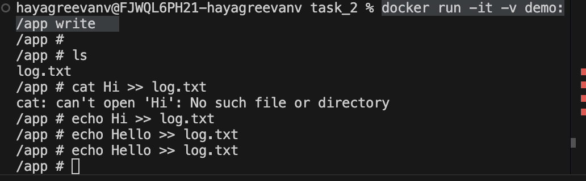
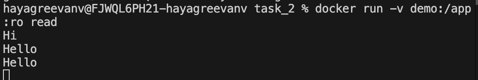

# Day 2 - Tasks

**Docker Volumes**
- Introduction to Docker Volumes
- Commands for managing volumes
- Difference between Bind mount and volume mounts
- Volume permissions
- Sharing volumes between container

**Docker layer and how layer caching works**
Understanding Docker Layers
Explanation of Docker’s layer caching strategy and how it speeds up builds
How the order of commands in a Dockerfile affects caching and image rebuild times.
How to use `.dockerignore` to exclude unnecessary files


## Assignments
**Assignment - 2,3**
	
- Create a Docker volume (e.g., shared_volume).
- Run a container with write permissions, mounting shared_volume.
- Run a container with read-only permissions, mounting shared_volume.
- Tail a file in the read-only container to view changes made by the write-enabled container.
 
- Create a docker volume and mount to the MySQL container to store the database data (/var/lib/mysql/data) 
- Create another docker volume and mount to the Apache2 container to store the web application data (/var/www/html) 
- Create a docker secret to store the MySQL DB credentials (username and password), so that it can be used to connect to the database from the web application.


``` bash
docker volume create demo
docker build -t write . -f Dockerfile_write
docker build -t read . -f Dockerfile_read
docker run -it -v demo:/app write
docker run -v demo:/app:ro read
```





``` bash
docker volume create mysql
docker run -d -p 3306:3306 -v mysql:/var/lib/mysql -e MYSQL_ROOT_PASSWORD=root mysql

docker volume create webserver
docker run -d -p 8000:80 -v webserver:/var/www/html ubuntu/apache2
docker cp ./index.html <container-name>:/var/www/html/index.html

echo "root"  | docker secret create mysql_user -
echo "hayagreevan"  | docker secret create mysql_password -
docker build -t webserver .
docker swarm init
docker stack deploy -c docker-compose.yaml myapp 

docker stack rm myapp
docker swarm leave --force
```