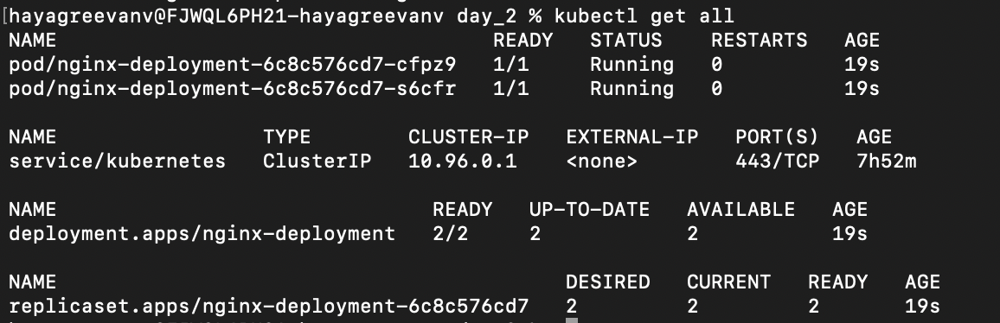

# Normal Tasks
	

## Task 1	
Spin up a simple nginx pod, Expose it to a service and access it on localhost (Check what to do for accessing from localhost)
	
https://kubernetes.io/docs/tutorials/services/connect-applications-service/

``` bash
kubectl run nginx --image=nginx:alpine
kubectl expose pod/nginx --type=NodePort --port 80

minikube service -n default nginx 
kubectl port-forward service/nginx 8080:80   

```
## Task 2
	
Deploy the above single pod using a Deployment and set replicas as 2
``` bash
kubectl create -f task_02.yaml
```



## Task 3
	
Deploy a MySQL stateful set application with 3 replicas and configure a volume of 5Gi each.
	
https://kubernetes.io/docs/tasks/run-application/run-replicated-stateful-application/
``` bash
kubectl create -f task_03/mysql_sts.yaml
```

## Task 4
	
Complete the below operations:
- Create a custom nginx image, push to docker-hub/ECR and pull the image.
- Create a deployment.yaml with contains custom-nginx as an image and deploy in k8's cluster.
- Create service.yaml route to created pod, expose outside world and verify it.
	
https://kubernetes.io/docs/tasks/configure-pod-container/pull-image-private-registry/#create-a-pod-that-uses-your-secret


# Debugging Tasks:
 
## Debugging-D2-01
	
Check for the pod named d2-01-nginx-pod in your namespace. The pod is not running properly. Identify the issue with the container image and fix it.
	
- [Pod Lifecycle](https://kubernetes.io/docs/concepts/workloads/pods/pod-lifecycle/)
- [Debugging Pods](https://kubernetes.io/docs/tasks/debug/debug-application/debug-pods/)
- [Images](https://kubernetes.io/docs/concepts/containers/images/)


## Debugging-D2-02
	
Check for the pod d2-02-web-pod and service d2-02-web-service in your namespace. The pod is running but the service cannot reach it. Identify why there are no endpoints and fix the connectivity issue (likely due to labels/selectors mismatch).
	
- [Services](https://kubernetes.io/docs/concepts/services-networking/service/)
- [Connecting Applications with Services](https://kubernetes.io/docs/tutorials/services/connect-applications-service/)
- [Labels and Selectors](https://kubernetes.io/docs/concepts/overview/working-with-objects/labels/)


## Debugging-D2-03
	
Check for the deployment d2-03-nginx-deployment in your namespace. It has 3 replicas configured but none of the pods are running successfully. Identify why the pods are crashing and fix the deployment.
	
- [Deployments](https://kubernetes.io/docs/concepts/workloads/controllers/deployment/)
- Debug Running Pods
- [Container Lifecycle](https://kubernetes.io/docs/concepts/containers/container-lifecycle-hooks/)


## Debugging-D2-04
	
Check for the deployment d2-04-app-deployment and service d2-04-app-service in your namespace. The pods are running but you cannot access the app through the service. Identify the port configuration issue and test connectivity using port-forward after fixing.
	
- Service Port Configuration
- [Port Forwarding](https://kubernetes.io/docs/tasks/access-application-cluster/port-forward-access-application-cluster/)
- [Troubleshoot Services](https://kubernetes.io/docs/tasks/debug/debug-application/debug-service/)

## Links
- [Pods and Containers - Kubernetes Networking] (https://www.youtube.com/watch?v=5cNrTU6o3Fw)
- [Kubernetes Pods, ReplicaSets, and Deployments in 5 Minutes](https://www.youtube.com/watch?v=iC-WxZGhFqs)
- [Kubernetes - StatefulSet](https://www.youtube.com/watch?v=pPQKAR1pA9U)
- [Kubernetes - DaemonSet](https://www.youtube.com/watch?v=49jgQADF638)
- https://kubernetes.io/docs/tutorials/kubernetes-basics/expose/expose-intro/
- https://kubernetes.io/docs/tasks/run-application/run-replicated-stateful-application/
- Minikube Docs - https://minikube.sigs.k8s.io/docs/start/
- K8s Documentation - https://kubernetes.io/docs/concepts/overview/
- CLI Reference - https://kubernetes.io/docs/reference/generated/kubectl/kubectl-commands#-strong-getting-started-strong-
- K8s Managed Providers: https://kubernetes.io/partners/
- Kubeadm setup: https://kubernetes.io/docs/reference/setup-tools/kubeadm/
- Kubernetes the hard way: https://github.com/kelseyhightower/kubernetes-the-hard-wa