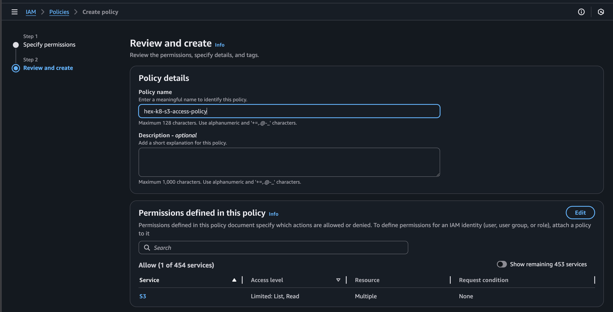
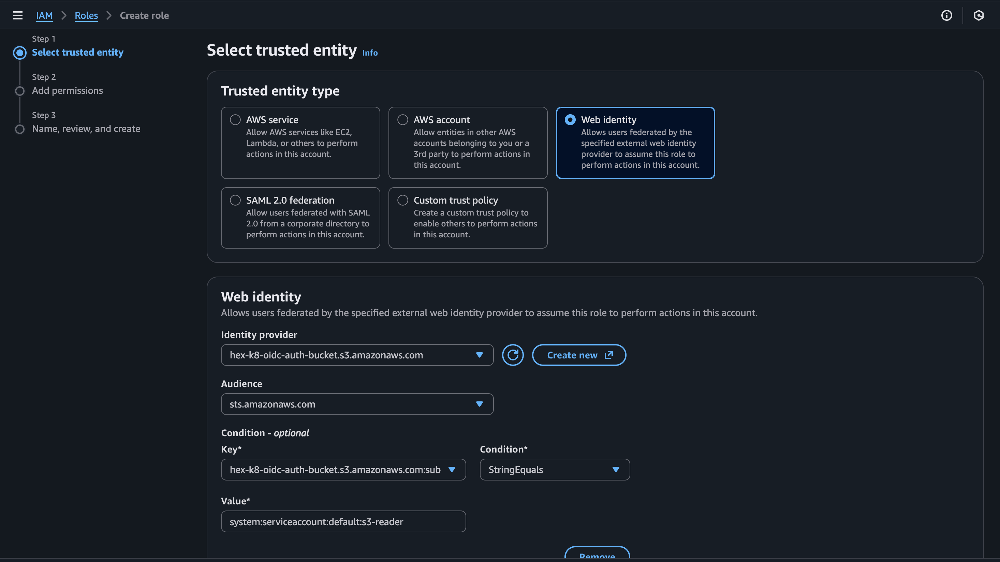

# Topics
 
 
- How oidc works? ( only overview)
- RBAC (Self learning)
- ABAC (Self learning)
- Cluster Role (Self learning)
- Cluster Role Binding.(Self learning)

# Tasks
1. Adding a new user to the cluster who should have only read-only access to the resources in your namespace (Note: Do it in your local cluster)
	Generate SSL certificate using cluster ca cert and ca key, associated with the user and try entering into the cluster with the newly created user details
    https://kubernetes.io/docs/reference/access-authn-authz/authentication/


``` bash
openssl genrsa -out readonly-user.key 2048

openssl req -new -key readonly-user.key -out readonly-user.csr -subj "/CN=readonly-user/O=readonly-group"

openssl x509 -req -in readonly-user.csr \
  -CA ~/.minikube/ca.crt \
  -CAkey ~/.minikube/ca.key \
  -CAcreateserial \
  -out readonly-user.crt \
  -days 365

kubectl config set-credentials readonly-user \
  --client-certificate=readonly-user.crt \
  --client-key=readonly-user.key

kubectl config set-context readonly-user-context \
  --cluster=minikube \
  --user=readonly-user

kubectl apply -f .


kubectl config use-context readonly-user-context

```

2. Create a deployment with init containers where the init container fetches a file from S3 and updates the local volume. Use only private S3 bucket
	
    IAM OIDC - https://docs.aws.amazon.com/eks/latest/userguide/associate-service-account-role.html

``` sh
minikube start

kubectl get --raw /openid/v1/jwks > jwks.json
kubectl get --raw /.well-known/openid-configuration > discovery.json

aws s3 mb s3://hex-k8-oidc-auth-bucket --region us-east-1

aws s3 cp jwks.json s3://hex-k8-oidc-auth-bucket/openid/v1/jwks

cat <<EOF > discovery.json
{
  "issuer": "https://hex-k8-oidc-auth-bucket.s3.amazonaws.com",
  "jwks_uri": "https://hex-k8-oidc-auth-bucket.s3.amazonaws.com/openid/v1/jwks",
  "response_types_supported": ["id_token"],
  "subject_types_supported": ["public"],
  "id_token_signing_alg_values_supported": ["RS256"]
}
EOF

aws s3 cp discovery.json s3://hex-k8-oidc-auth-bucket/.well-known/openid-configuration


aws iam create-open-id-connect-provider \
  --url https://hex-k8-oidc-auth-bucket.s3.amazonaws.com \
  --client-id-list sts.amazonaws.com \
  --thumbprint-list 9e99a48a9960b14926bb7f3b02e22da2b0ab7280

{
    "OpenIDConnectProviderArn": "arn:aws:iam::590852515231:oidc-provider/hex-k8-oidc-auth-bucket.s3.amazonaws.com"
}


minikube start \
  --extra-config=apiserver.service-account-issuer=https://hex-k8-oidc-auth-bucket.s3.amazonaws.com \
  --extra-config=apiserver.service-account-jwks-uri=https://hex-k8-oidc-auth-bucket.s3.amazonaws.com/openid/v1/jwks \
  --extra-config=apiserver.service-account-signing-key-file=/var/lib/minikube/certs/sa.key \
  --extra-config=apiserver.api-audiences=sts.amazonaws.com

```
Creating AWS IAM Policy 

``` json
{
	"Version": "2012-10-17",
	"Statement": [
		{
			"Sid": "VisualEditor0",
			"Effect": "Allow",
			"Action": [
				"s3:GetObject",
				"s3:ListBucket"
			],
			"Resource": [
				"arn:aws:s3:::hex-k8-bucket",
				"arn:aws:s3:::hex-k8-bucket/*"
			]
		}
	]
}
```

Creating AWS IAM Role

``` json
{
    "Version": "2012-10-17",
    "Statement": [
        {
            "Effect": "Allow",
            "Principal": {
                "Federated": "arn:aws:iam::<account-id>:oidc-provider/hex-k8-oidc-auth-bucket.s3.amazonaws.com"
            },
            "Action": "sts:AssumeRoleWithWebIdentity",
            "Condition": {
                "StringEquals": {
                    "hex-k8-oidc-auth-bucket.s3.amazonaws.com:sub": "system:serviceaccount:default:s3-reader",
                    "hex-k8-oidc-auth-bucket.s3.amazonaws.com:aud": "sts.amazonaws.com"
                }
            }
        }
    ]
}
```

``` bash
kubectl apply -f .
```

3. Explore aws-auth and how your user access is setup in the EKS cluster and Existing roles and rolebindings in the cluster
	

## Links
- [An Illustrated Guide to OAuth and OpenID Connect - Youtube](https://www.youtube.com/watch?v=t18YB3xDfXI)
- https://chatgpt.com/c/691c761e-f3c4-8321-a959-4b11c2b82dba
- https://gemini.google.com/share/42fbaf391702