- https://www.udemy.com/course/certified-kubernetes-administrator-with-practice-tests/
- https://github.com/kodekloudhub/certified-kubernetes-administrator-course.git
- https://notes.kodekloud.com/

K8s Documentation - https://kubernetes.io/docs/concepts/overview/

CLI Reference - https://kubernetes.io/docs/reference/generated/kubectl/kubectl-commands#-strong-getting-started-strong-
K8s Managed Providers: https://kubernetes.io/partners/
Kubeadm setup: https://kubernetes.io/docs/reference/setup-tools/kubeadm/
Kubernetes the hard way: https://github.com/kelseyhightower/kubernetes-the-hard-way

Master Node - Worker Node

Master Node - etcd, Kube Scheduler, Kube API Services, Kube Controller Manager
Worker Node - Kubelet, Kube Proxy

Kubernetes supports only Container Runtime Interface (CRI) container runtimes.
Docker doesn't support CRI
ContainerD - ctr (debugging), nerdctl (like docker cli)
crictl - Managed by Kubernetes, used for debugging, supports all CRI container runtimes.


etcd - Key-Value Store
- comes with etcdctl as cli
    - etcdctl put key1 value1
    - etcdctl get key1
- used to store cluster's - Nodes, Pods, Configs, Secrets, Accounts, Bindings, Others

Controller Manager
 - Node-Manager
 - Replication Manager
 - etc

## Pods
Containers in Pods - share same network as localhost, share same storage
Each pod have dedicated netwok namespace and virtual ethernet adapter
Each pod has a pause container (also called sandbox container) which reserves and holds network namespace and enables container communication

## StatefulSet
kind: StatefulSet
Stateful applications - Applications that stores data Eg. Databases
Remote Storage
Pod State 
Pod Identifier $(sts-name)-(ordinal) Eg. mysql-0
Master-Slave Architecture (1 write, all read)
Creation and deletion of replicas are done sequential order in sequence (not parallel)
Each pod has own dns endpoint ${pod_id}.{service_name}
Sticky Identity - able to retain its state and role


## YAML
apiVersions for YAML 
- Pods, Service - v1
- Deployment, Replicaset - apps/v1

Template :
- apiVersion
- kind
- metabata
- spec


Replicaset Demo
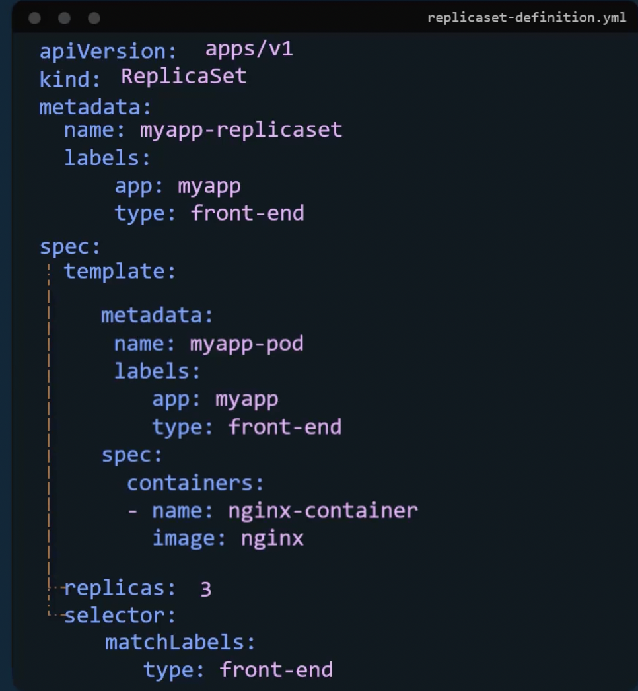

## Services
Establishes Communication
Automatically acts as LoadBalancer, If multiple pods have same selector labels
Service automatically works across all the nodes
Types:
- NodePort (Port Range : 30000 - 32767)
- ClusterIP
- LoadBalancer
- Headless (ClusterIP: None)

Multi Port Services are stored with name

## Ingress
Supports Path Based Routing and implements SSL security as well and acts as Internal Load Balancer.

It needs Ingress Controller.
It has Ingress Resources (whic is similar to nginx reverse proxy)


## Commands and Args
docker entrypoint - k8 command
docker cmd - k8 args

## Env variable
```yaml
in-container:
    env:
    - name: name
    - value: value
```

``` yaml
in-container:
    envFrom:
    - configMapRef:
        name: name
```
## Config Map
Key-Value Pair storage for env

Imperative
``` sh
kubectl create configmap <name> \
--from-literal=name=value \
--from-literal=name=value 

or
--from-file=filename
```

Declarative
``` yaml
apiVersion: v1
kind: ConfigMap
metadata:
    name: name
data:
    name: value
```
``` yaml
apiVersion: v1
kind: ConfigMap
metadata:
    name: name
fromfile: file
```

## Secrets

Imperative
``` sh
kubectl create secret generic <name> \
--from-literal=name=value \
--from-literal=name=value 

or
--from-file=filename
```


## Resource Quota (Max Resource that can be used on that node by overall containers)
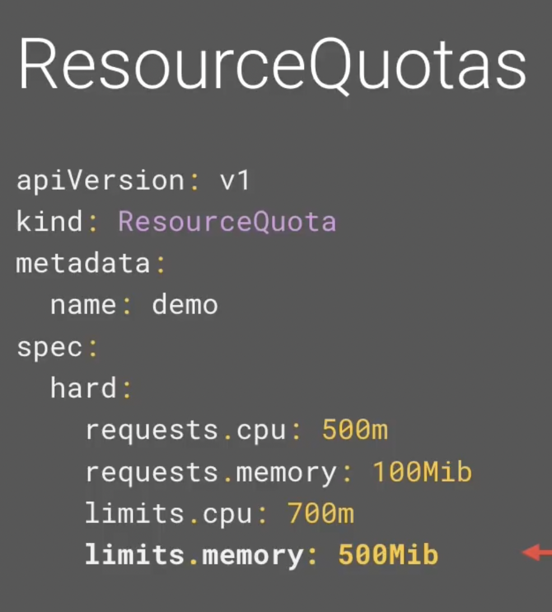

## Service Accounts
- used by other applications or services to interact with k8
- tokens are used for authentication
- every ns has default sa
- every pod id created with default sa
- `serviceAccountName` is used to specify which sa to mount on pod
- k8 automatically creates token and mounts it in pod at `/var/run/secrets/kubernetes.io/serviceaccount`, it automatically rotates token, it automatically expires the token while deletion of pod


``` bash
kubectl create serviceaccount <name>

kubectl create token <serviceaccountname> --duration 2h  # default 1h

```

## Taint & Tolerations
Taint - applied on node
Tolerant -applied on pod

Taint-effects : NoSchedule, PreferNoSchedule, NoExecute

Taint on node
``` bash
kubectl taint nodes node-name key=value:taint-effect
kubectl taint nodes node1 app=blue:NoSchedule
```

Tolerant on Pod
Double quotes prefered for tolerations
``` yaml
spec:
  tolerations:
  - key: "app"
    operator: "Equal"
    value: "blue"
    effect: "NoSchedule"
```

## Node Selector
Selecting node based on label - it is fixed, not flexibe (OR/NOT operation is not possible)

on Pod
``` yaml
spec:
    nodeSelector:
        size: Large
```

on Node
``` bash
kubectl label nodes <node-name>  key=value
kubectl label nodes node-1 size=Large
```

## Node Affinity
Types of Node Affinity:
    - requiredDuringSchedulingIgnoredDuringExecution
    - PreferredDuringSchedulingIgnoredDuringExecution
    - requiredDuringSchedulingRequiredDuringExecution (Planned)

Operators: In, NotIn, Exists, etc
``` yaml
spec:
  affinity:
    nodeAffinity:
      requiredDuringSchedulingIgnoredDuringExecution:
        nodeSelectorTerms:
        - matchExpressions:
          - key: size
            operator: In
            values:
            - Large 
```


## Node Affinity and Taint & Tolerations
Node Affinity is set up on pod to choose specific node and add tolerations
Taint is set up on node to accept only pods with respective toleration, not any other

## Multi-Container Pod
Colocated Containers
Regular Init Containers
Sidecar Containers

``` yaml
spec:
    initContainers:  # For Regular Init Containers
    - name:
      image:
      restartPolicy: Always # For Sidecar Containers
```


## AutoScaling

- Scaling Workloads
    - Horizontal Pod Autoscaling (HPA)
    - Vertical Pod Autoscaling (VPA)
- Scaling Cluster Infra
    - Cluster Autoscaler

**HPA**
``` bash
kubectl autoscale deployment <deploy> --cpu-percent=50 --min=1 --max=10
```
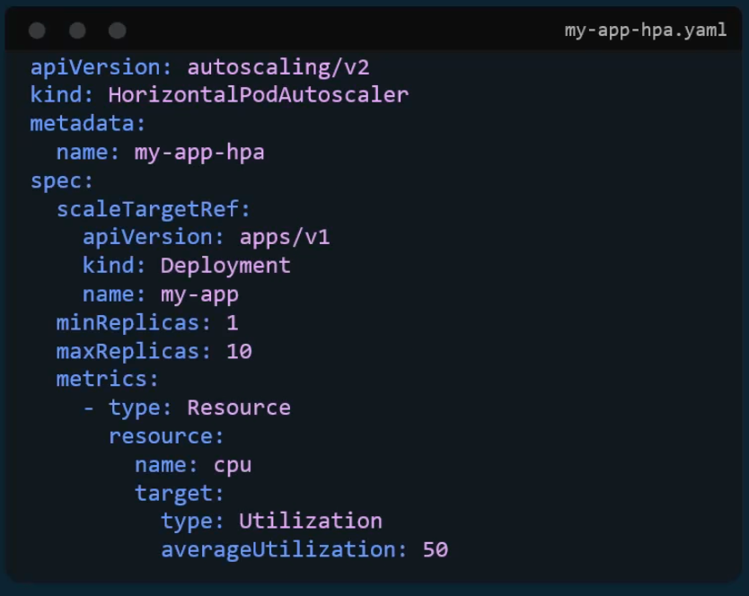

**VPA**  
is not inbuilt
It has VPA Admission Controller, VPA Updater, VPA Recommender

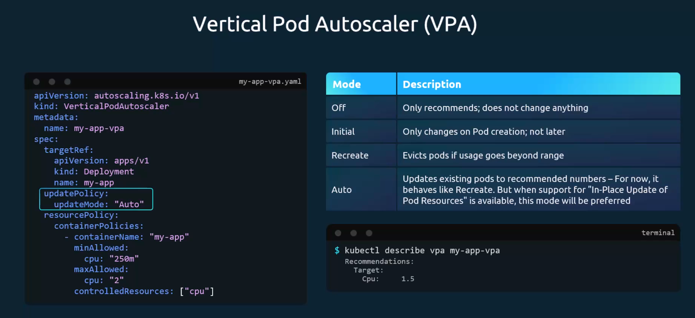


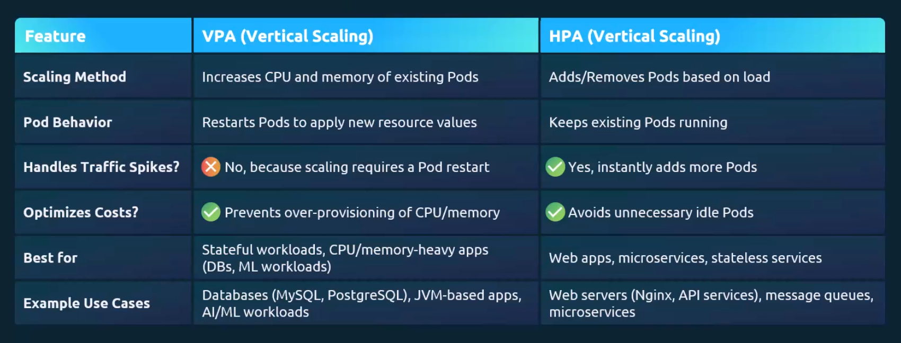

## Admission Controller

- Validating
- Mutating

## Network Policies
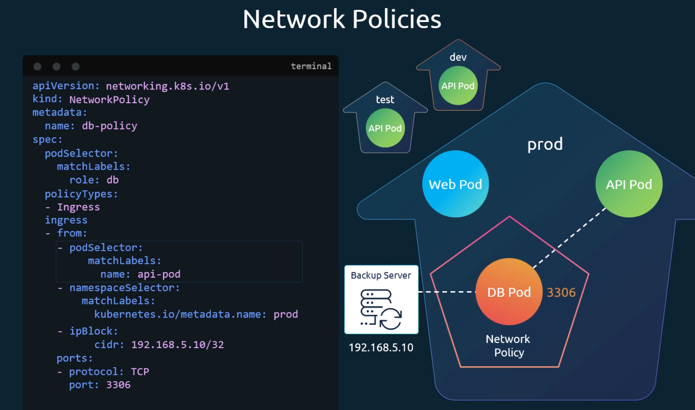


## Config
``` sh
kubectl config use-context <context-name>
```
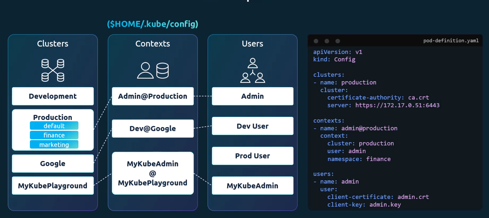

## Authorization

Authorization Mechanisms:
- Node
- ABAC
- RBAC
- WebHooks
- AlwaysAllow
- AlwaysDeny

### RBAC

Applied in the namespace level
(describe namespace: at metadata or it'll consider default namespace)
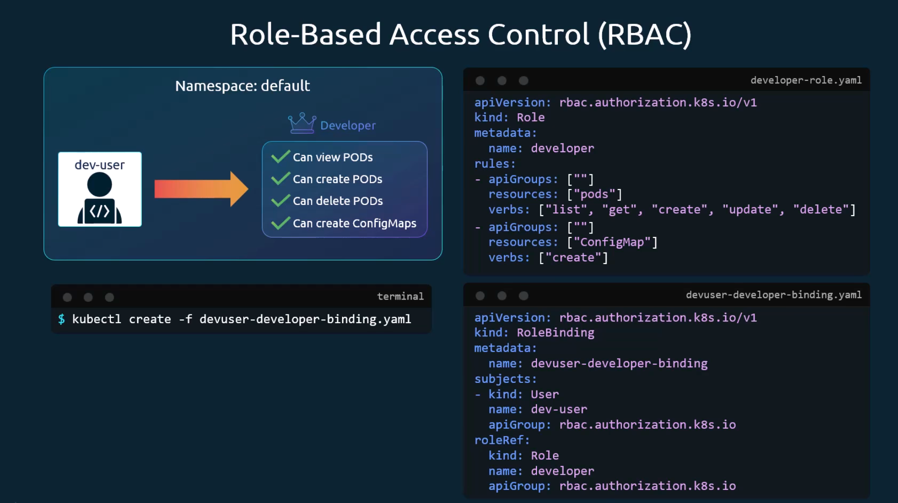

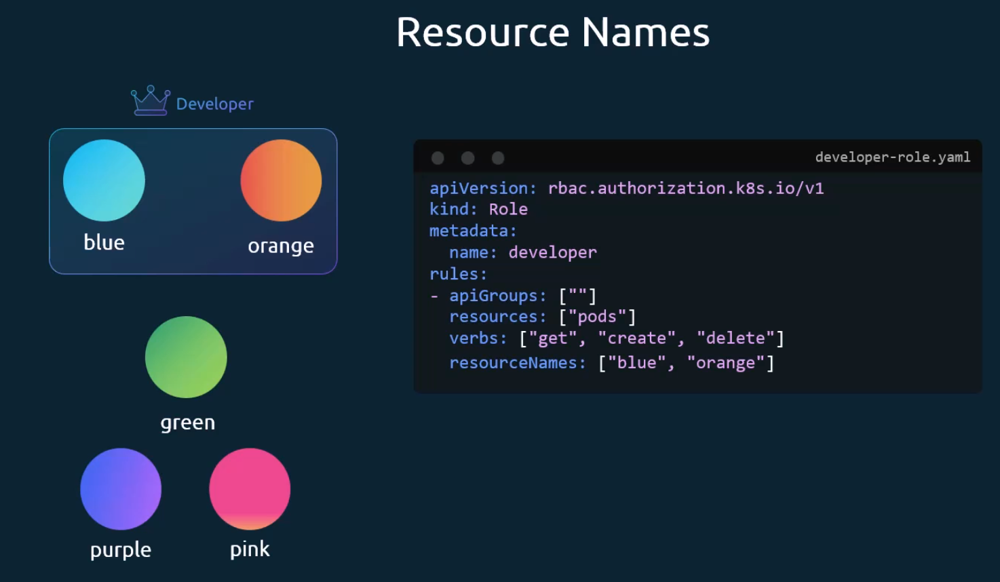

## ClusterRoles
Same as RBAC but It applies at cluster level not namespace level.
It also used to configure RBAC for pods, services, etc, but it applies for all namespaces.
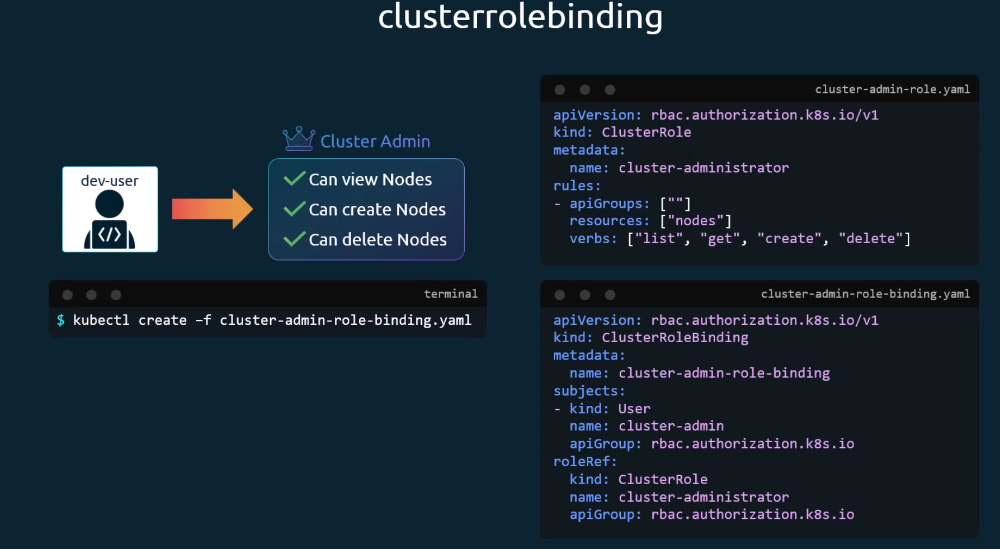

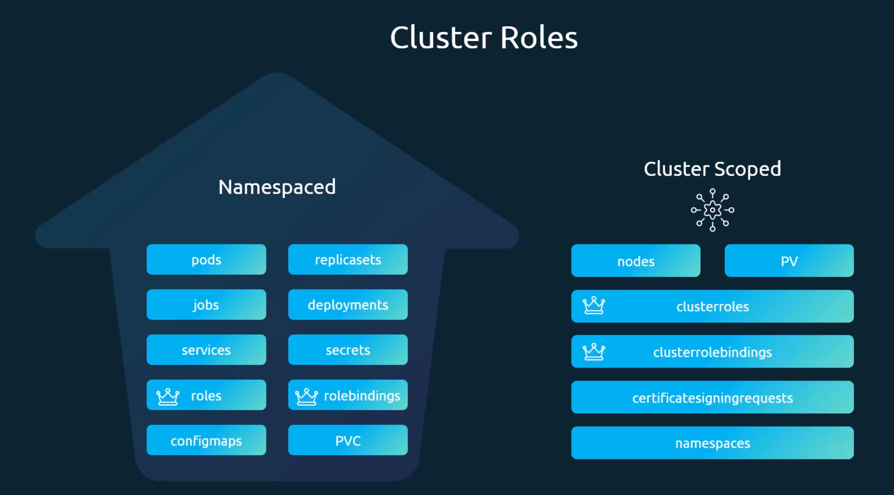


### Checking Access of Role

``` sh
kubectl auth can-i create deployment
kubectl auth can-i create deployment --as <role>

```


# Helm
Packages - ArtifactHub

``` sh

helm search hub [pkg-name]

helm repo add [local-name] [repo-url]

helm install [release-name] [chart-name]
helm install --set key=value [release-name] [chart-name]
helm install --values values.yaml [release-name] [chart-name]

helm upgrade [release-name] [chart-name]
helm rollback [release-name] [revision-no]

helm list
helm history
helm uninstall [release-name]

helm pull --untar [chart-name]
helm pull --untar bitname/wordpress

```
charts.yaml
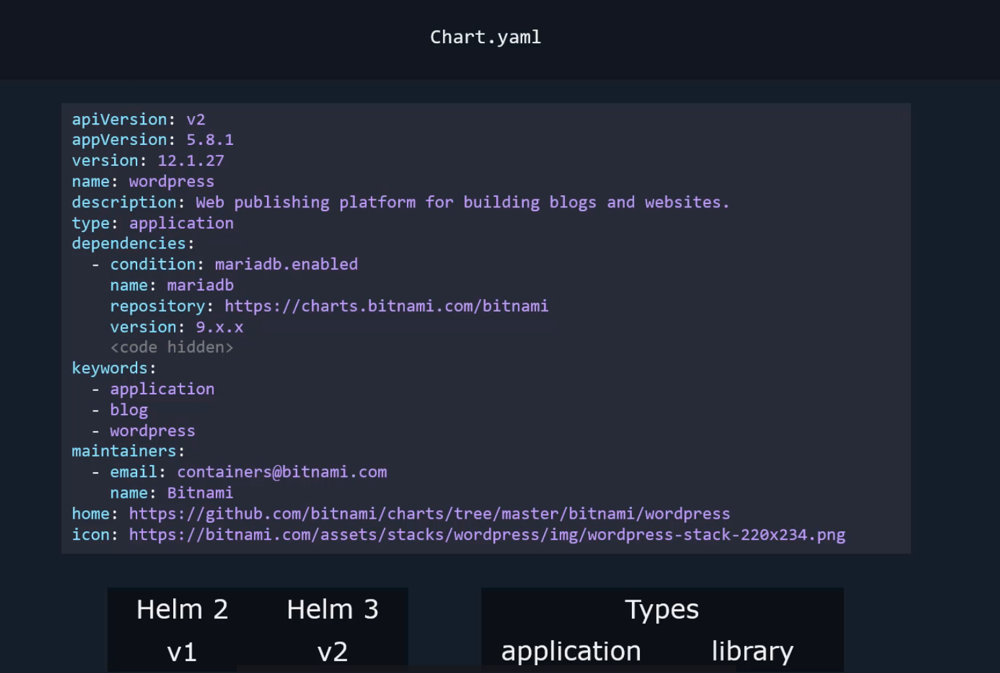


## Kustomize

kustomize.yaml - resources and transformations

``` sh
kubectl apply -k <dir>
```

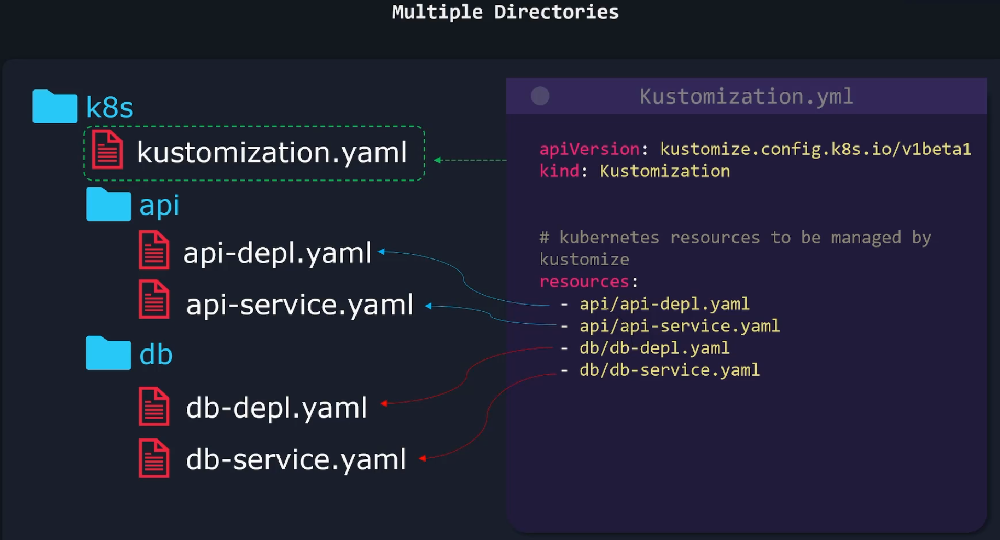
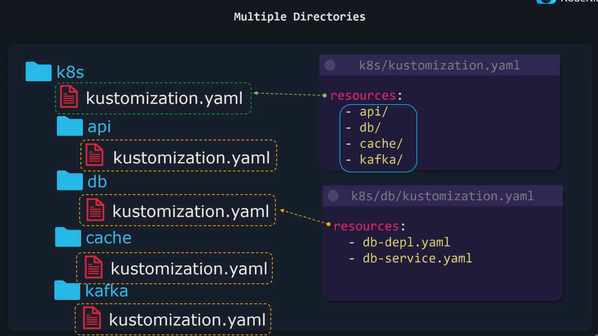

#### Transformers 
- Common Transformers
    - commonLabels
    - namePrefix/Suffix
    - namespace
    - commonAnnotations
- Image Transformers
    ``` yaml
    images:
        - name: nginx
          newName: haproxy
          newTag: 2.4
    ```

#### Patches
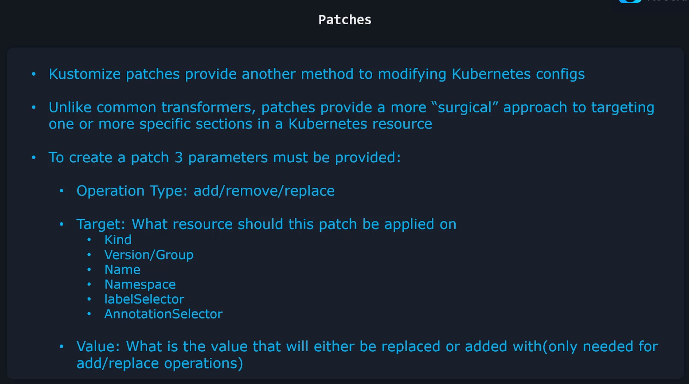
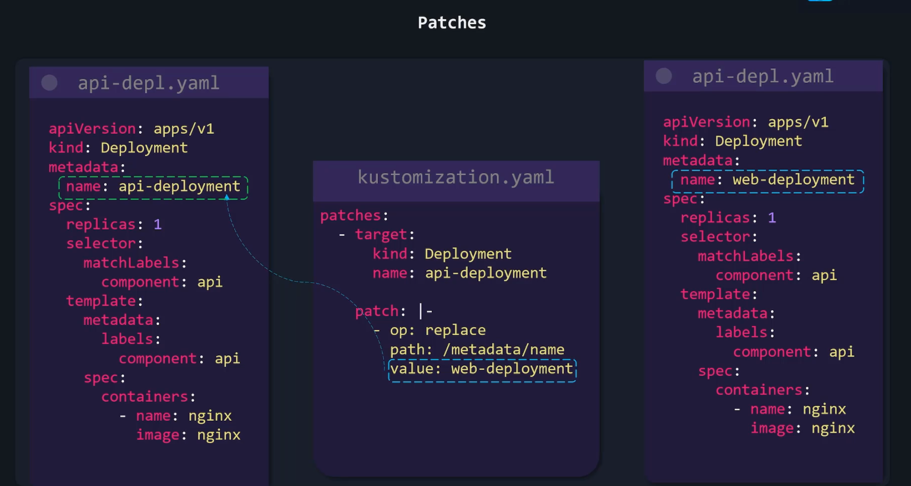
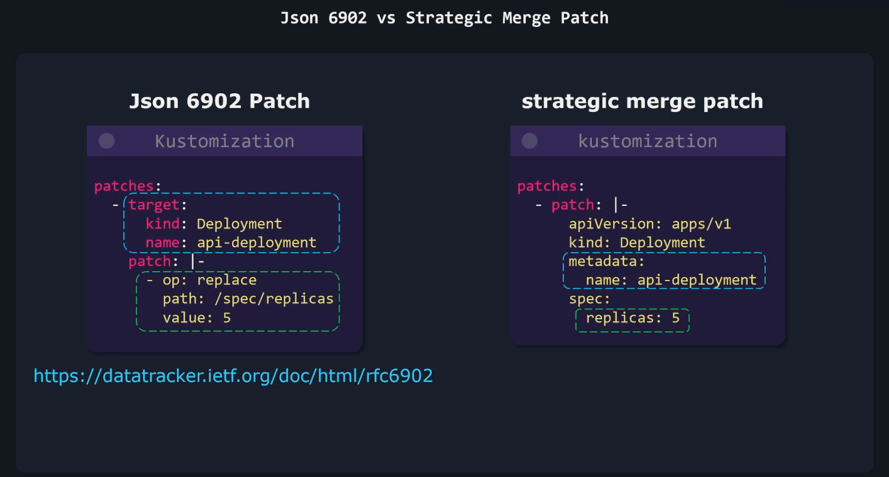
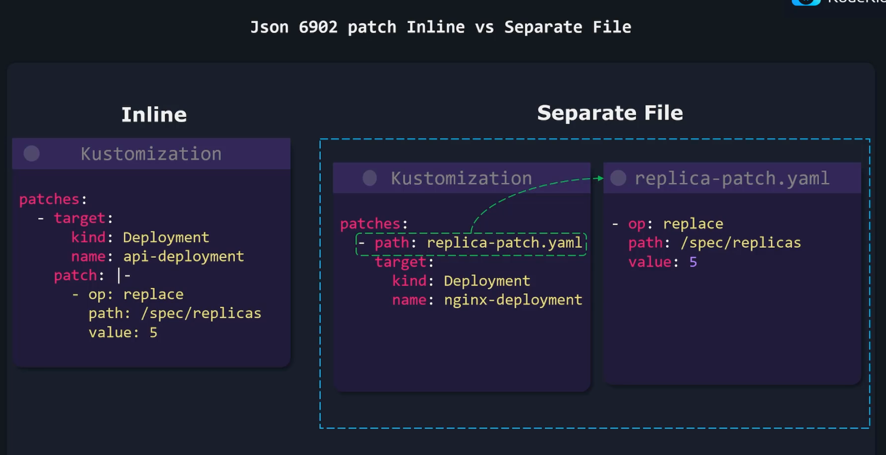


Replace List
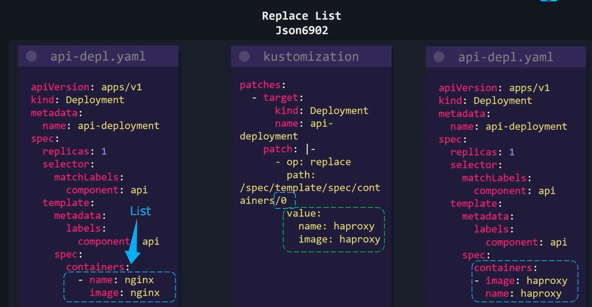
Add List
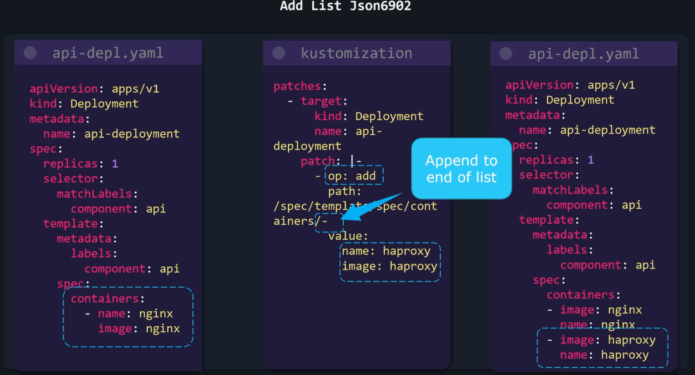

### Overlays
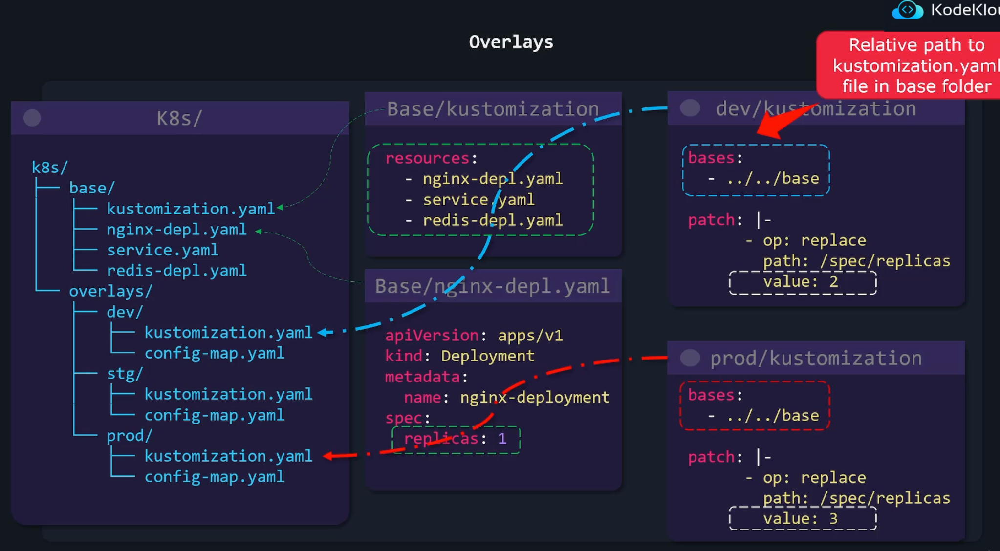
aws eks --region us-east-1 update-kubeconfig --name interns-k8s-training  --role-arn arn:aws:iam::853973692277:role/trainee-hayagreevan-6fbb3e68
kubectl config set-context --current --namespace=trainee-hayagreevan
